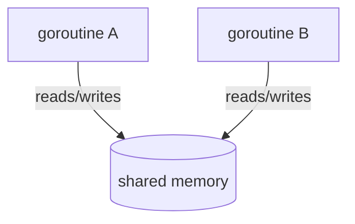

# Project Documentation

## Overview
This repository is an Astro 5 blog based on AstroPaper with enhancements:
- Internationalization (i18n) for `en` and `zh-TW`
- Locale-mirrored content and routes
- Language switcher component
- Dynamic OG image endpoint under `/og/[lang]/[slug].png`
- A right-rail Table of Contents (TOC)
- Theme tweaks (clean white look, refined font)
- First bilingual article on Go shared memory

## Quick Start
```bash
pnpm i
pnpm dev
```

## Build & Preview
```bash
pnpm build
pnpm preview
```

## Project Structure (key parts)
- `src/pages/` – routes
  - `posts/` – listing and post details
  - `[lang]/` – localized mirrors of index and posts
  - `og/` – dynamic OG images per locale/slug
- `src/data/blog/` – content collection (mirrors via `en/` and `zh-TW/`)
- `src/components/` – UI components including `LangSwitcher.astro` and `TOC.astro`
- `src/layouts/` – `Layout.astro`, `PostDetails.astro`
- `src/content.config.ts` – content collection schema
- `astro.config.ts` – Astro configuration (now includes `i18n`)

## Internationalization
Enabled in `astro.config.ts`:
```ts
export default defineConfig({
  i18n: {
    defaultLocale: "en",
    locales: ["en", "zh-TW"],
  },
});
```
Routing mirrors live under `src/pages/[lang]/...`. Content is mirrored by locale under `src/data/blog/en` and `src/data/blog/zh-TW`. Posts include a `lang` field; defaults to `en` if omitted.

Use `LangSwitcher` to navigate sibling locales. It generates the matching route using `getRelativeLocaleUrl`.

## Content Collections
Configured in `src/content.config.ts` with Zod schema. Frontmatter important fields:
- `title`, `slug`, `description`, `pubDatetime`
- `tags`, `featured`, `draft`
- `lang` ("en" | "zh-TW")

## OG Images
An endpoint at `/og/[lang]/[slug].png` provides per-post OG images. Meta tag is set in `PostDetails.astro`.

Install the helper package:
```bash
pnpm add -D astro-og-canvas
```

## Theme & TOC
- Colors tuned for a clean white background; body font switched to sans.
- `TOC.astro` renders a sticky right-rail table of contents on large screens based on Markdown headings.

## Diagrams (Mermaid)
Mermaid.js is enabled on post pages; use fenced code blocks:
```md

```

## Creating Posts
1. Add markdown in `src/data/blog/<locale>/your-slug.md`.
2. Include frontmatter fields (`title`, `slug`, `description`, `pubDatetime`, `lang`, ...).
3. Visit `/posts/your-slug` or `/<locale>/posts/your-slug`.

## Deployment
Set `SITE.website` in `src/config.ts` and run `pnpm build`. Serve `dist/`.