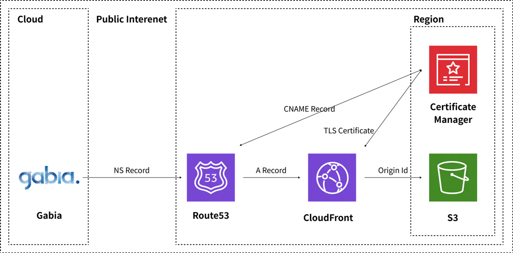

### 월간 CS CI/CD 나는 왜 시작했나?

운영 중인 베이킹 예약 웹 어플리케이션은 현재 AWS Elasticbeanstalk 에 배포 되어 관리 하고 있다.
배포의 자동화는 아니지만, 그래도 aws cli를 이용하여 배포를 진행하고 있었고
잦은 수정이 아니기에 배포에 대한 불편함을 크게 느끼지 않았다.
불편함은 없었지만, CI/CD를 통해 배포 자동화를 진행 하면 더 나은 개발 환경을 만들 수 있을 것이라는 생각이 들었다.
그래서 CI/CD를 공부하고 적용해 보기로 결정했다.

### CI/CD 란 무엇인가?

- CI/CD는 지속적 통합(Continuous Integration)과 지속적 배포(Continuous Deployment)을 의미한다
- 지속적 통합이 필요한 이유
- 시나리오 예
- a 개발자 - 모듈 A 개발
- b 개발자 - 모듈 A 내 a 기능 개발

> 제품은 지속적 통합을 통해 어플리케이션의 정산 작동에 대한 안정성을 보장해 준다.
> 하지만 이 과정은 테스트 코드에 대한 팀의 문화가 필요하며, 동시에 개발자 간의 협업이 필요하다.

### Github Flow전략에 대한 이해

다양한 Git브랜치 전략

- Git Flow
- GitHub Flow
- GitHub Rebase

##### GitHub Flow 를 선택한 이유

- 현재 개발자가 나 혼자 이기에 간단한 전략 선택 (오버 엔지니어링 방지)
- CI/CD 구축에 능숙하지 않다.

##### GitHub Flow 전략

- Main브랜치와 Feature 브랜치로 나누어 개발
- Main 브랜치는 배포를 했을 때, 항상 문제가 없음을 보장 해야 하는 안전한 코드 베이스가 존재
- Feature 브랜치는 기능 개발을 진행하는 브랜치로, Main 브랜치에서 분기되어 생성된다.
- Feature 브랜치에서 개발이 완료 되면, Main 브랜치로 PR을 생성한다.
- 어떤 구현부를 만들 것인지 구체적인 브랜치 이름이어야 한다.

### CloudFront, S3 배포 인프라 구성



특정 도메인을 주소창에서 검색하면 통상적으로 그 도메인을 소유하고 있는 네임 서버 쪽으로 요청을 보내게 된다.
도메인을 구입한 곳이 가비아 인데, aws에서 제공하는 CloudFront와 S3를 이용하여 도메인을 연결하고자 한다.
그래서 네임서버를 가비아에서 AWS Route53의 네임서버로 변경하게 되면, 요청이 AWS로 들어오게 된다.

hyunsu.shop 으로 사용자가 접속을 시도하면, 네임서버인 AWS Route53로 요청을 보내고, Route53는 해당 URL에
A레코드가 있는지 확인한다. 만약 CloudfFront를 향한 A레코드가 있다면 CloudFront로 요청을 보낸다.

CloudFront에 대한 설명을 간략히 하자면, 사용자에게 컨텐츠를 보여주고자 할 때는 브라우저와 CloudFront 사이에 HTTPS 프로토콜을 사용한다.
이 때, SSL/TLS 인증서를 사용하여 클라이언트와 CloudFront 사이의 통신이 암호화 된다.

여기서 CloudFront가 가져와야 할 컨텐츠는 오리진 서버 즉 S3에 있는 정적 파일을 가져오는데
이 때에도 통신을 암호화하기 위해 SSL/TLS를 사용할 수 있다.

/index.html에 있는 리액트 파일에 접근 함으로서 CSR방식으로 페이지를 렌더링 한다.

### Terraform을 이용한 인프라 구축

[실습 Gitbub Repo](https://github.com/sooster910/2024-04-cicd-week-1-template)

1. aws IAM 계정 생성
2. aws-cli profile 설정하기
   2.1 aws 계정이 여러개 임을 감안하여 멀티 프로필 생성
3. terraform 설치
4. DNS 리소스 배포하기

```bash
cd ./infra/dns

terraform init
terraform apply -var="profile=monthly-cs" -var="domain_name=<가비아에서 구매한 도메인>"

예)
terraform apply -var="profile=monthly-cs" -var="domain_name=unchaptered.shop"
```

5. Enter a value: yes 입력 후 나온 dns_ns_record 값들을 가비아에 등록 한다.
6. CloudFront, S3 배포

```bash
cd ../../ # 프로젝트 경로로 가기
cd ./infra/website

terraform init
terraform apply -var="profile=monthly-cs" -var="domain_name=<가비아에서 구매한 도메인>"

예)
terraform apply -var="profile=monthly-cs" -var="domain_name=unchaptered.shop"
```

7. 로컬에서 배포 - 빌드 파일 s3에 업로드하기

```bash
aws s3 cp --recursive ./build s3://<가비아에서 구매한 도메인> --profile monthly-cs

예)
aws s3 cp --recursive ./build s3://unchaptered.shop --profile monthly-cs
```

### 마무리

- 현재 나의 프로젝트에서 알맞은 CI/CD 전략인 GitHub Flow 를 선택할 수 있게 되었다.
- Terraform 을 처음 접해보는 시간이었다. 실습을 진행하면서도 Terraform의 명령어에 집중 하다기 보단 왜 사용할까에 조금 더 생각해보았다.
- aws 인프라 구축을 GUI를 통해 진행해 왔었는데 Terraform을 통해 인프라를 구축하면서, IaC(Infrastructure as Code) 로 인프라 스트럭쳐의 도구임을 경험 할 수 있었다.
- 조금 더 찾아보니 어떤 아티클에서는 이런 부분을 강조하기도 했다.
  > 여기서 가장 중요한 것은 AWS 실제 인프라와 Backend에 저장된 상태가 100% 일치하도록 만드는 것입니다. 테라폼을 운영하면서 최대한 이 두가지가 100% 동일하도록 유지하는 것이 중요한데, 테라폼에서는 이를 위해 import, state 등 여러 명령어를 제공합니다.
