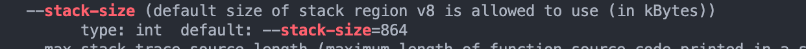
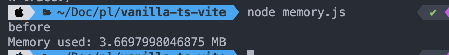
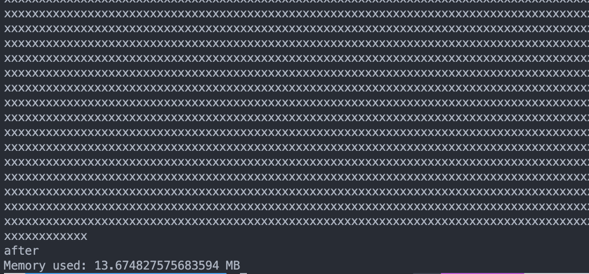
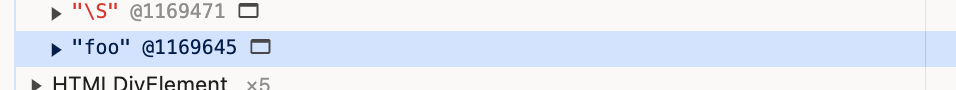

### 들어가면서

이 글은 1편 '기본형 데이터와 참조형 데이터를 알아야 하는 이유'에 대한 후속편입니다.

Java나 C, C++ 언어에서는 기본형은 스택에, 참조형은 힙에 들어간다고 알고 있고, JS 또한 기본형은 스택, 참조형은 힙에 할당된다고 주장하는 글들이 많습니다. 그렇게 알고 있었습니다.

하지만 JS는 다릅니다. 기본형, 참조형 모두 힙에 할당되는데, 정재형 님의 '코어 자바스크립트' 책에서도 "엄밀히 따지면 자바스크립트의 모든 데이터 타입은 참조형 데이터일 수밖에 없다."라는 부분이 언급됩니다.

그래서 이번 포스팅에서는 JavaScript에서 기본 값이 스택에 할당되고 객체는 힙에 할당된다고 하는 주장이 사실이 아니며, 이에 대해 리서치한 것들을 정리해 보았습니다.

이 글의 상당수는 거의 https://www.zhenghao.io/posts/javascript-memory 와 https://www.youtube.com/watch?v=OG_AZnPokGw&t=510s을 참고하였습니다.

### 스택 메모리와 힙 메모리를 직접 확인해보자

- 스택 메모리 확인


- v8의 스택 크기를 가져옵니다. 864kb를 할당 받았습니다.



- 아래와 같은 코드를 실행합니다.

```javascript
function memoryUsed() {
  const mbUsed = process.memoryUsage().heapUsed / 1024 / 1024;

  console.log(`Memory used: ${mbUsed} MB`);
}

console.log("before");
memoryUsed();

const bigString = "x".repeat(10 * 1024 * 1024);
console.log(bigString); // need to use the string otherwise the compiler would just optimize it into nothingness

console.log("after");
memoryUsed();
```

- bitString 연산 전



- bigString 연산 후



문자열 연산을 통해 10MB의 메모리가 사용되었는데, 이는 스택이 아닌 힙에서 할당된 것입니다. 위 이미지를 통해 힙 사용량이 정확히 10MB만큼 증가한 것을 확인할 수 있습니다(3MB->13MB). 이를 통해 기본형 데이터인 string이 힙에서 메모리가 할당되었음을 알 수 있습니다.

`bigString` 을 다른 변수에 할당하면 힙 메모리로 부터 총 20mb 를 할당 받게 되는 걸까?

```javascript
const copyBigString = bigString;
```

같은 데이터를 참조하는 변수가 있을 경우 어떻게 되는지 devtools를 통해 확인해 봅니다.

```javascript
const btn = document.querySelector("#btn");

btn.addEventListener("click", e => {
  const string1 = "foo";
  const string2 = "foo";
});
```

버튼을 클릭했을 때 `foo`라는 문자열을 담은 변수가 2개 있으니 (string1, string2) 메모리를 할당하는 곳이 두 개이지 않을까 하지만 같은 문자열 데이터를 여러 번 메모리에 저장하는 대신 단일 복사본을 생성하고 여러 참조가 같은 데이터를 가리키도록 하는 방식으로 작동합니다. 이를 [문자열 인턴]()이라고 하고 v8에서도 이 기술을 사용하여 메모리를 최적화합니다.

아래의 'foo' @1169645로 한 개의 데이터만 저장된 것으로 확인할 수 있습니다.



**그럼 'foo' @116945는 문자열이 담긴 주소일까?**

아닙니다. 글쓴이의 내용을 인용하자면 다음과 같습니다.

> Chrome DevTools does not show where the pointers reside in memory but rather where they point to. Also the numbers you see e.g. @206637 do not represent raw memory addresses. If you want to inspect the actual memory, you need to use a native debugger.

@116945가 실제 데이터를 담고 있는 메모리 주소가 아니라는 점이고, 데이터를 담고 있는 메모리 주소를 바라보고 있는 포인터 이다. 라고 이해됩니다.

여기서 글쓴이가 표현한 자바스크립트의 변수는 대부분 포인터

> JavaScript variables are (mostly) pointers

라고 표현 했는데 그도 그럴것이 크롬에서 사용하는 JS엔진인 v8이 c++ 로 쓰여졌으므로 포인터 개념을 차용하지 않았을까 라는 생각도 듭니다.

이는 v8 의 코드를 통해 어느 정도는 유추 할 수 있는데,

```javascript
V8_INLINE Local<Primitive> Undefined(Isolate* isolate) {
  using S = internal::Address;
  using I = internal::Internals;
  I::CheckInitialized(isolate);
  S* slot = I::GetRoot(isolate,   I::kUndefinedValueRootIndex);  //✅
  return Local<Primitive>(reinterpret_cast<Primitive*>(slot));
}

```

_S_(즉, internal::Address\*) 타입의 `slot` 포인터를 반환하고 있습니다.
undefined의 원시 값조차도 내부적으로는 C++ 객체를 가리키는 메모리 주소로 구현되었습니다.

그럼 고수준인 자바스크립트에서는 변수에 값을 할당했을 때 또는 아무것도 할당하지 않은 경우(undefined)일 때, **변수는 데이터의 실제 값이 아닌, 데이터가 저장된 위치(메모리 주소)를 참조한다**는 점으로 이해할 수 있습니다.(이 부분은 제가 이해한 바를 표현한 것인데, 잘못 접근, 표현했다면 알려주세요.)

그렇다면 정말 모든 Primitive 데이터 타입은 참조형인가?

그렇지는 않다 입니다. small integer -231에서 231-1까지의 정수는 231에서 최적화되어 추가 저장소를 할당할 필요가 없다고 합니다. 이에 대한 더 자세한 설명은 아래 링크를 참고해 주세요.

- [JavaScript Memory Model Demystified](https://www.zhenghao.io/posts/javascript-memory#javascript-variables-are-mostly-pointers)
- [Pointer Compression in v8](https://v8.dev/blog/pointer-compression#value-tagging-in-v8)

### 마무리

- 자료들을 통해 책에서 보던 "엄밀히 따지면 자바스크립트의 모든 데이터 타입은 참조형 데이터일 수 밖에 없다." 에 대한 궁금증이 어느정도 해소된 것 같습니다.

- 참조형, 기본형 모두 힙에서 할당 된다는 것을 문자열 할당 예시인 노드의 `process.memoryUsage()` 를 통해 확인했으며, chrome devtool의 heap allocation에서도 string 타입이 힙에서 할당되는 점 도 알 수 있었습니다.

- 자바스크립트의 기본형도 결국 참조형 이다 (small integer를 제외하고). 변수에 할당하기 위해서는 는값을 복사하는것이 아닌 주소값을 복사하는 점을 v8코드를 통해 그리고 기본값인 undefined도 포인터를 리턴하는 부분으로 확인할 수 있었습니다.

---

### 참고 자료

- JavaScript Memory Model Demystified, 22 JANUARY, 2022, https://www.zhenghao.io/posts/javascript-memory#javascript-variables-are-mostly-pointers
- Kateryna Porshnieva. _Visualised guide to memory management in JavaScript | JSHeroes 2023_, JSHeroes 2023 https://www.youtube.com/watch?v=OG_AZnPokGw&t=510s
