## 이슈 : ReactDOMServer does not yet support Suspense

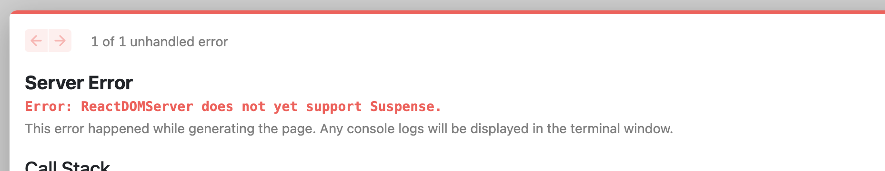

이렇게 Next.js에서 에러가 나오고 에러가 발생된 근원지를 알려준다면, **디버깅의 기법중 역추적에 의한 디버깅(Debugging by backtracking)** 으로 가는 것이 해결할 확률이 가장 높습니다.

실행한 페이지의 소스코드는 아래와 같습니다.

```tsx
function Relay(props: RelayProps) {
  const data = useLazyLoadQuery(RelayQuery, {});
  console.log(data);
  return (
    <div>
      <h1>Relay</h1>
    </div>
  );
}

const RelayQuery = graphql`
  query relayQuery {
    ping
  }
`;

export default Relay;
```

에러 메시지에 명시된 ReactDom Server 많이 들어봤지만, 어떤 일을 할까요?

[Server React DOM APIs – React](https://react.dev/reference/react-dom/server)

> The `react-dom/server` APIs let you render React components to HTML on the server. These APIs are only used on the server at the top level of your app to generate the initial HTML. A [framework](https://react.dev/learn/start-a-new-react-project#production-grade-react-frameworks) may call them for you. Most of your components don’t need to import or use them.

애플리케이션에서 서버 측 렌더링을 수행하기 위해 "react-dom/server" API를 사용할 수 있으며, 이러한 API는 주로 앱의 초기 HTML을 생성하는 데 활용된다는 내용을 설명하고 있습니다. 또한, 프레임워크나 라이브러리가 이러한 API들을 대신 호출할 수 있으며, 대부분의 React 컴포넌트는 이 API들을 직접 가져오거나 사용할 필요가 없다고 합니다.

ReactDomServer는 공식문서에서 설명한대로 서버 측 렌더링을 수행하기 위해 프레임워크나 라이브러리가 이런 API를 호출할 수 있다고 합니다.

ReactDOMServer는 누가 호출 하는 걸까요?

에러를 추적해 보았습니다.

react-dom 모듈의 `ReactDOMServerRenderer`에서 호출 하고 있습니다.

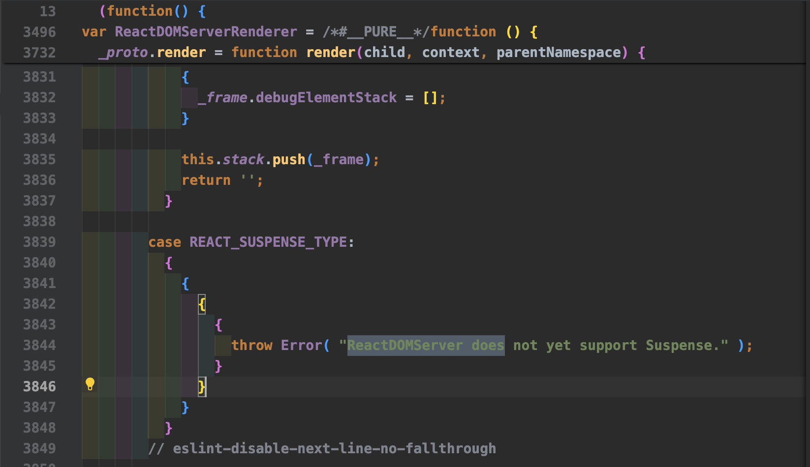

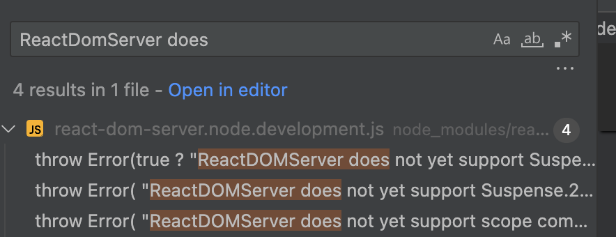

여러군데에서 트리거 되고 있습니다. 이 에러가 정확히 어느 부분에서 트리거를 하는지 예측 할 수 없어 이렇게 1111, 2222, 3333 으로 숫자를 넣어두고 다시 실행 했습니다.

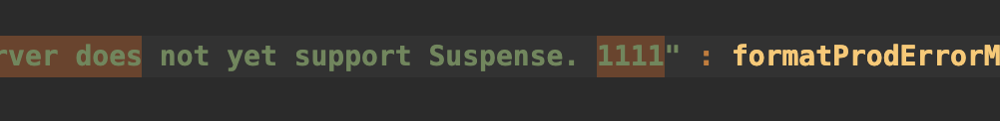

1111 에서 감지가 되었습니다.

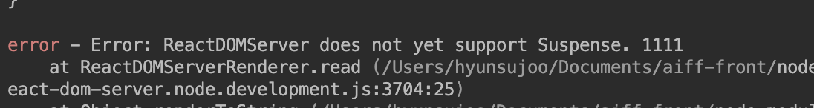

정확한 소스 코드를 찾았습니다.

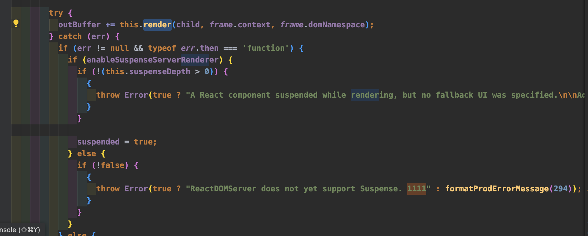

이해한 대로 해석을 해보자면 `this.render()`함수 호출시 try.catch 문에 의해 에러가 감지되었음을 알 수 있습니다. 제가 마주한 에러는 `enableSuspenseServerRenderer`가 `false`일 때 그리고 `!false` 즉 `true`일 때 이 에러를 냅니다.

**그럼 단서는 enableSuspenseServerRenderer 이 `false`라서 생긴 거라고 추측할 수 있겠네요!**

`enableSuspenseServerRenderer` 이 친구는 어디서 어떻게 값이 변경될까요?

찾아보니 어디에도 사용되는 곳이 없고 이렇게 default값으로 false를 가진 변수만 정의되어있네요.

그럼 이 함수에 들어오면 `enableSuspenseServerRenderer` 는 지원하지 않는다는 것으로 짐작 할 수 있을 것 같습니다.

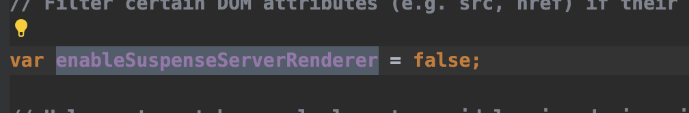

그럼 저의 에러는 애초에 enableSuspenseServerRenderer를 지원하지 않는 ReactDomSERVER를 사용한다고 가정해본다면, **근데 저는 Suspense를 명시적으로 사용한적이 없는걸요?**

현재 컴포넌트를 렌더링 하고 있는 ReactDOMServer 는 아직 Suspense 를 지원하고 있지 않다입니다.

문제를 다시 정의해보겠습니다.

- 현재 serverside rendering입니다. 왜냐하면 아무런 next api 없이 그냥 함수호출 방식으로 작성하게 되면 next.js는 default로 serverside rendering으로 동작합니다.
- 그리고 소스 코드엔 suspense를 사용하지 않았습니다.

그런데 **소스 코드엔 Relay로 데이터를 페칭해오는 useLazyLoadQuery 함수를 사용하고 있습니다. 그리고 Relay공식문서에서 찾은건 Relay는 내부적으로 suspense를 사용한다 입니다.**

---

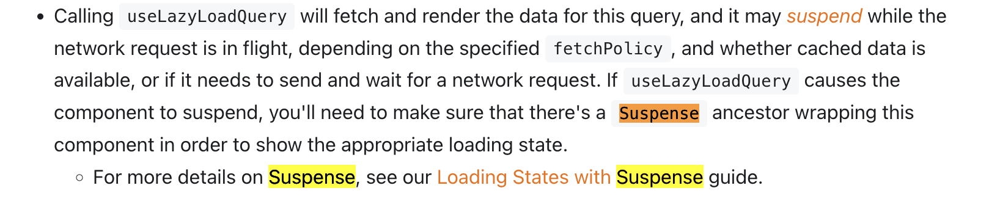

[useLazyLoadQuery | Relay](https://relay.dev/docs/api-reference/use-lazy-load-query/)

tutorial에서도 Suspense 컴포넌트를 지웠을 때 http 통신에서는 response를 받아왔지만 화면에서 렌더링을 못해주고 있었습니다.

**Relay 를 사용하여 컴포넌트를 렌더링 하기 위해선 Suspense를 사용해야 하는데, Next.js12 에서는 suspense를 지원하지 않는 게 문제였습니다.**

Suspense를 지원하지 않는다뇨? 이렇게 next/dynamic 으로 suspense사용이 가능해집니다.

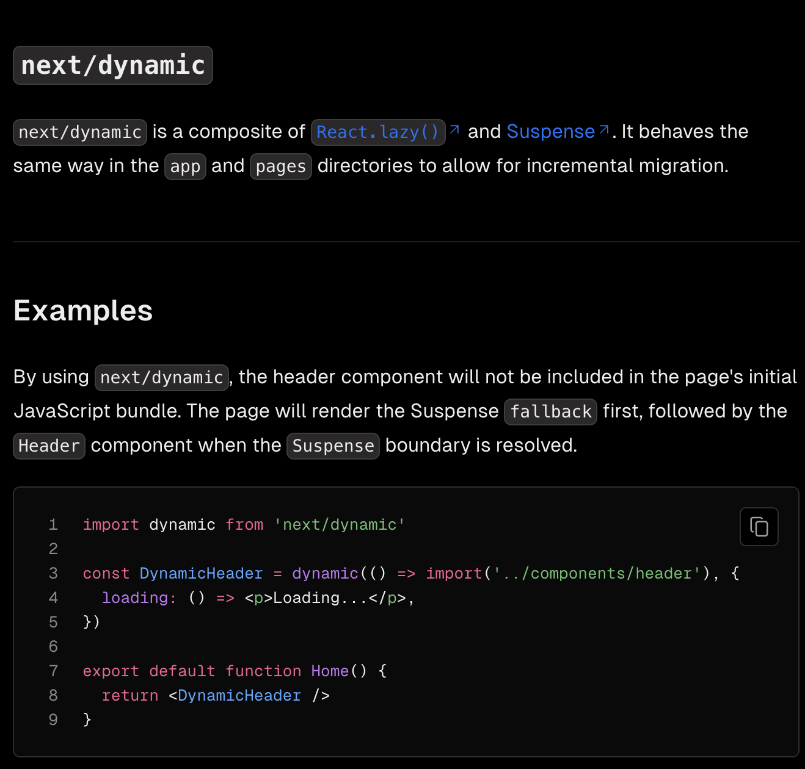

**그럼 Suspense를 사용하면 되겠다고 생각 할 수 있습니다. 그런데 Next.js의 Suspense 는 리액트 기반의 Suspense이므로, 버전 별로 어디까지 지원해주는지를 확인해야합니다.**

**React17에서는 Suspense가 공식적으로 지원되지 않지만 Next 12버전에서 React17의 suspense를 사용하기 위해서는 CSR 전략에서만 가능합니다.**

이 부분을 해결 하기 위해 `SuspenseWapper` 컴포넌트를 만들어 csr시점에 relay 쿼리를 처리하는 컴포넌트를 렌더링 합니다.

코드를 보겠습니다.

```tsx
import React, { Suspense } from "react";
interface SuspenseWrapperProps {
  fallback: JSX.Element;
  children: React.ReactNode;
}
const isBrowser = typeof window !== "undefined";
const SuspenseWrapper: React.FunctionComponent<SuspenseWrapperProps> = ({
  fallback,
  children,
  ...restProps
}) => {
  if (isBrowser) {
    return <Suspense fallback={fallback}>{children}</Suspense>;
  }
  return fallback;
};
export default SuspenseWrapper;
```

Next.js12 (React17을 사용할 때) 에서는 React에서 제공하는 Suspense API 를 사용합니다. `SuspenseWrapper` 는 `fallback`과 `children`을 props로 받습니다. 또한 `...restProps`를 통해 추가적인 props를 받을 수 있습니다.

이 컴포넌트는 `isBrowser`라는 변수를 통해 현재 코드가 브라우저 환경에서 실행되는지 확인합니다. 만약 브라우저 환경이라면, `Suspense` 컴포넌트를 사용하여 `children`을 렌더링하고, 데이터 로딩 중에는 `fallback`을 표시합니다. 만약 브라우저 환경이 아니라면, `fallback`만을 반환합니다.

이렇게 정의된 `SuspenseWrapper` 컴포넌트는 다른 파일에서 임포트하여 사용할 수 있도록 export 됩니다. 이 컴포넌트를 사용하면, 서버 사이드 렌더링 환경에서 Suspense 기능이 문제를 일으키는 것을 방지할 수 있습니다.

그럼 유저가 페이지를 방문했을 때 부터 시작해서 각 페이지 및 컴포넌트의 렌더링 전략을 어떻게 가져가야 할까요?

모든 페이지와 컴포넌트들을 CSR 로 가져가야 할까요? 만약 모든 페이지와 컴포넌트를 클라이언트 측 렌더링 (CSR)으로 처리한다면, Next.js가 제공하는 서버 사이드 렌더링 (SSR) 기능을 활용하지 못하게 됩니다. 이는 Next.js의 가장 큰 장점 중 하나를 제한하는 결과가 됩니다. (= 물론 제가 relay로 마이그레이션 하기전 Next 프로젝트이기도 하지만)

제가 선택한 방법은,

최초 페이지 렌더링시 SSR을 사용하여 초기 페이지 로딩을 최적화합니다. SSR은 검색 엔진 최적화 (SEO)를 개선하고 초기 로딩 성능을 향상시킵니다. Relay 쿼리는 CSR로 처리합니다.

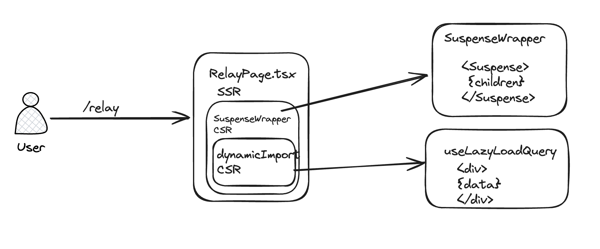

```tsx
import * as React from "react";
import { useLazyLoadQuery } from "react-relay";
import { graphql } from "relay-runtime";
import dynamic from "next/dynamic";
import SuspenseWrapper from "@app/components/SuspenseWrapper";
export interface RelayProps {}

const DynamicRelay = dynamic(() => import("@app/components/SuspenseRelay"), {
  ssr: false,
  loading: () => <p>loading...</p>,
});

function Relay(props: RelayProps) {
  return (
    <>
      <h1>Relay Page on SSR </h1>
      <SuspenseWrapper fallback={<p>loading...</p>}>
        <DynamicRelay />
      </SuspenseWrapper>
    </>
  );
}

export default Relay;
```

- React와 Relay를 사용하여 데이터를 가져오는 간단한 컴포넌트를 정의합니다.
- GraphQL 쿼리를 정의합니다. 이 쿼리는 `ping` 필드만 요청합니다. 이 쿼리는 `useLazyLoadQuery` 훅을 통해 실행됩니다.

```tsx
import * as React from "react";
import { graphql, useLazyLoadQuery } from "react-relay";
import { SuspenseRelayQuery } from "./../../../__generated__/SuspenseRelayQuery.graphql";

interface SuspenseRelayProps {}

const RelayQuery = graphql`
  query SuspenseRelayQuery {
    ping
  }
`;
const SuspenseRelay: React.FunctionComponent<SuspenseRelayProps> = () => {
  const data = useLazyLoadQuery<SuspenseRelayQuery>(RelayQuery, {});
  console.log("Data", data);

  return (
    <>
      <div>
        <h1>SuspenseRelay</h1>
      </div>
    </>
  );
};

export default SuspenseRelay;
```

SSR에서 이루어질 Suspense입니다.

```tsx
import React, { Suspense } from "react";
interface SuspenseWrapperProps {
  fallback: JSX.Element;
  children: React.ReactNode;
}
const isBrowser = typeof window !== "undefined";
const SuspenseWrapper: React.FunctionComponent<SuspenseWrapperProps> = ({
  fallback,
  children,
  ...restProps
}) => {
  if (isBrowser) {
    return <Suspense fallback={fallback}>{children}</Suspense>;
  }
  return fallback;
};
export default SuspenseWrapper;
```

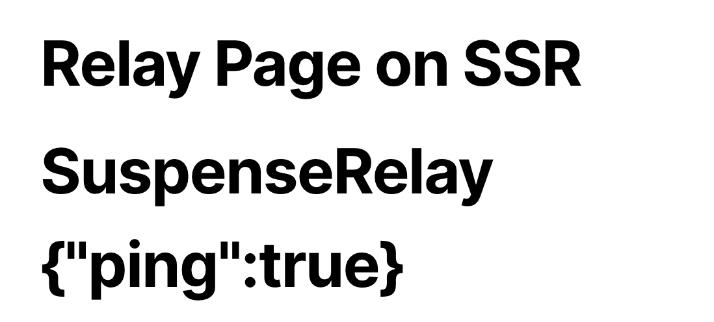

이로써 버전간의 suspense 지원 상태를 알게 되었되는 계기가 되었습니다.
