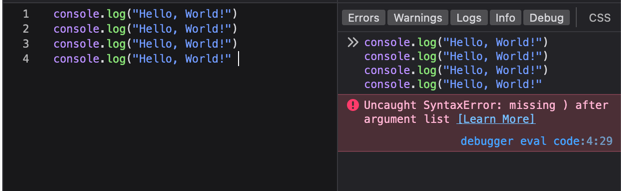
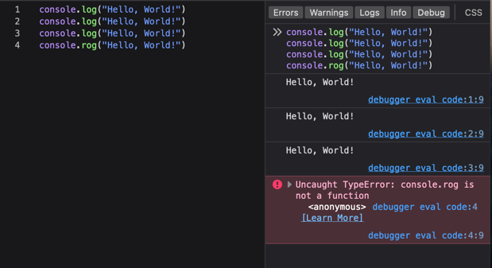
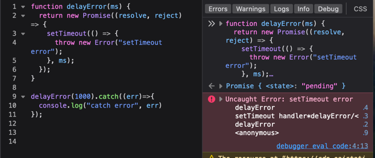
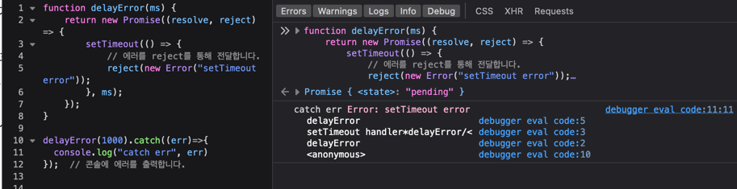
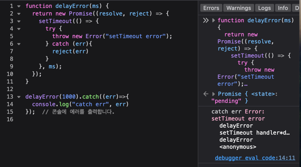
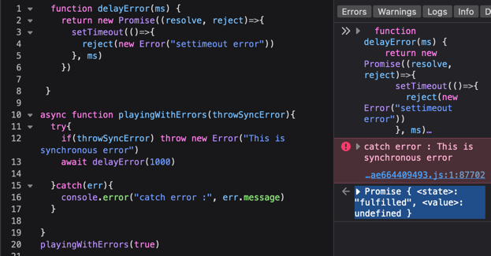
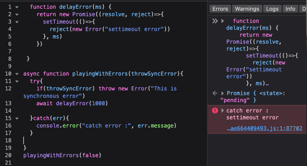

### 동기의 한계 그리고 비동기 등장

100000개의 데이터를 정렬하는 동안 유저는 사이드 패널을 확인하고 싶어
클릭 동작을 일으킨다. 그런데 화면에는 사이드 패널이 열리지 않는다.
왜냐하면 현재 메인스레드는 정렬 작업이 점유 하고 있기 때문에 그 외의 다른 어떤일도 할 수 없다.
자바스크립트의 싱글스레드 특성 때문에 이런 일이 발생한다.
하나의 긴 작업(정렬)을 수행하는 동안, 인터페이스(사이드 패널 열림/닫힘) 가 계속 반응적으로 유지 할 수 있게 하는 것이
비동기 작업이다. 즉 동기 작업의 블로킹 문제를 해결 할 수 있다.

자바스크립트 엔진의 메인스레드는 하나이다 (싱글 스레드) 그러니깐 한번에 하나의 작업만 한다는 것인데,
100000 개의 데이터를 정렬하기 까지 2초 걸린다면, 2초 동안은 다른 작업이 실행 되지 않는다.

이것이 동기식 처리 방식이다.

비동기에서는 blocking 이 아닌 nonblocking 이 가능해진다.
하지만 비동기 처리는 주의 깊게 관리할 필요가 있다. 그렇지 않으면 예상치 못한 문제를 마주하게 된다.
동시에 십만개의 비동기 작업이 호출 된다면, 가용 메모리를 모두 소모하게 되어 Out Of Memory 가 발생할 수 있다.
그래서 비동기 작업의 동시성(concurrency) 을 관리하는 것이 중요하다.
어떤 식의 관리를 말하는 걸까?
한번에 많이 비동기 함수 호출을 하지 않는 것이다. 통제, 제한 해야 한다.
통제, 제한은 실행 할 수 있는 비동기 작업의 개수가 되겠다.

잠깐 JS에서의 예외/오류처리에 대해 먼저 알아 보겠다.

## JS에서의 예외/오류처리

프로그램 실행 전 발생하는 오류 : 구문 오류(Syntax Error)
프로그램 실행 중에 발생하는 오류 : 런타임 오류(Runtime Error) 또는 예외 (Exception)

**JavaScript에서는 Syntax Error가 아닌 모든 에러는 런타임 오류 또는 예외 이다.**

## 오류와 예외는 다르다.

#### Syntax Error는 프로그램 실행 전에 발생하는 오류로, 코드를 실행하기 전에 발생한다.

- 프로그램 실행 전 이기 때문에, 코드 실행이 일어나지 않는다.

```javascript
console.log("Hello, World!")
console.log("Hello, World!")
console.log("Hello, World!")
console.log("Hello, World!" // <-- Syntax Error

```



#### Type Error는 프로그램 실행 중에 발생 하는 **예외**로, 정상적인 코드는 실행이 된다.

```javascript
console.log("Hello, World!");
console.log("Hello, World!");
console.log("Hello, World!");
console.rog("Hello, World!"); // <-- Type Error
```



정적 언어 에서는 위와 같은 타입 에러는 컴파일 시점에 발견 되어 프로그램이 실행 되지 않지만, 동적 언어인 JS는 구문 오류(Syntax Error)를 제외한 모든 오류는 예외로 처리 된다.
이런 예외를 처리해 주지 않으면 이후의 코드 실행이 되지 않는 문제가 생긴다.

---

## Promise의 예외처리

#### 1. Promise 내 setTimeout 에서 예외 처리를 캐치 하지 못하는 경우

다음과 같이 setTImeout 콜백 함수 내 예외 처리를 위해 throw를 했는데, catch 블록에서 잡히지 않는 이유는 뭘까?

```javascript
function delayError(ms) {
  return new Promise((resolve, reject) => {
    setTimeout(() => {
      throw new Error("setTimeout error");
    }, ms);
  });
}

delayError(1000).catch(err => {
  console.log("catch error", err);
});
```



에러 전파와 실행 컨텍스트 관점 :

주로 에러는 에러가 발생한 스코프 또는 호출 스택 내에서 처리된다.
setTimeout과 같은 비동기적 실행에서 에러가 발생했을 때, 콜백 함수의 실행 컨텍스트는 `setTimeout`을 호출한 실행 컨텍스트과는 완전히 분리 되어 있으므로 에러 전파를 못하기 때문에,
catch 블록에서 잡히지 않는다.

#### 2. 1번에 대한 해결 : reject를 이용하여 외부로 전파, setTimeout내 try..catch 처리

##### reject를 이용하여 외부로 전파

`Promise`의 `reject`를 통해 외부로 에러를 전파 하여 catch에서는 반환된 Promise객체의 reject를 통해 에러를 처리 할 수 있다.

```javascript
function delayError(ms) {
  return new Promise((resolve, reject) => {
    setTimeout(() => {
      // 에러를 reject를 통해 전달합니다.
      reject(new Error("setTimeout error"));
    }, ms);
  });
}

delayError(1000).catch(err => {
  console.log("catch err", err);
}); // 콘솔에 에러를 출력합니다.

// 콘솔에 에러를 출력합니다.
```



##### setTimeout 내 try..catch 처리

- setTimeout 내부에서 try..catch 블록을 사용하여 에러를 처리하고, reject를 통해 외부로 전파한다.

```javascript
function delayError(ms) {
  return new Promise((resolve, reject) => {
    setTimeout(() => {
      try {
        throw new Error("setTimeout error");
      } catch (err) {
        reject(err);
      }
    }, ms);
  });
}

delayError(1000).catch(err => {
  console.log("catch err", err);
}); // 콘솔에 에러를 출력합니다.
```



두가지 방법의 공통점은 에러를 전파하기 위해 Promise내 비동기 처리에서는 **`reject()`** 를 사용 해야 한다.

## Async/await의 예외처리

async/await 에서의 예외처리 방법은 try...catch 블록을 사용하여 예외처리를 한다.
try..catc블록을 사용하면 동기적인 throws와 비동기적 프로미스의 예외 처리 두 상황에서 모두 catch에서 예외처리를 할 수 있기 때문이다.

#### 동기적인 throws 예외 처리

- `throwSyncError` 가 true 일 때, 동기적 에러를 전파 하여 catch 블록에서 잡는다.

```javascript
function delayError(ms) {
  return new Promise((resolve, reject) => {
    setTimeout(() => {
      reject(new Error("settimeout error"));
    }, ms);
  });
}

async function playingWithErrors(throwSyncError) {
  try {
    if (throwSyncError) throw new Error("This is synchronous error");
    await delayError(1000);
  } catch (err) {
    console.error("catch error :", err.message);
  }
}
playingWithErrors(true);
```



#### 비동기적인 Promise의 예외 처리

- playWithErrors(false) 로 호출하여 delayError() 함수의 비동기 에서 예외 처리를 전파하여 catch 블록에서 잡는다.

```javascript
function delayError(ms) {
  return new Promise((resolve, reject) => {
    setTimeout(() => {
      reject(new Error("settimeout error"));
    }, ms);
  });
}

async function playingWithErrors(throwSyncError) {
  try {
    if (throwSyncError) throw new Error("This is synchronous error");
    await delayError(1000);
  } catch (err) {
    console.error("catch error :", err.message);
  }
}
playingWithErrors(false);
```



- async/await 에서 try/catch 는, 현재 포스팅에는 callback에 대해 언급하진 않았지만 callback 에서의 예외 처리와 비교하여 확실히 가독성이 좋고, 비동기적/동기적 에러를 모두 지원 함을 알 수 있다.

```javascript
const delayError = async ms => {
  try {
    await new Promise((resolve, reject) => {
      setTimeout(() => {
        reject(new Error("setTimeout error"));
      }, ms);
    });
  } catch (err) {
    console.log("catch err", err);
  }
};
```

위와 같이 try...catch 만 사용 하여 잠재적 예외처리를 잘 캐치하면 좋겠지만, 언제나 상황에 따라 예외는 있는 법이다.
try 구문 내에서 await 를 사용한 비동기 호출에서 예외처리와 , await를 사용하지 않고 비동기 함수를 호출 상황은 다른 결과를 나타낸다.
결론을 이야기하면 await를 사용하지 않았을 경우 try..catch 블록에서 에러를 잡을 수 없다.

예제 https://itnext.io/error-handling-with-async-await-in-js-26c3f20bc06a

#### return vs return await

예외처리시 return 과 return await에 대한 재미있는 차이도 있다.

> #### 결론을 먼저 이야기 하자면,
>
> 1. 에러를 잘 전파 하려면 다른 특정 함수에 에러를 감싸지 말자. stack trace 에서 잃을 수도 있다.
> 2. await를 사용하지 않고 return을 사용 할 거면 상위 스코프에서 catch 블록을 사용하여 에러를 처리 할 수 있도록 하자.
> 3. eslint의 no-return-await 가 deprecated 된 정황을 보았을 때, v8팀의 성능 최적화를 통해 return await 를 사용하는 것이 성능적으로 문제가 되지 않고 오히려 더 좋을 수도 있다. [this V8 blog entry 참고](https://v8.dev/blog/fast-async)

비동기 함수 내에서 반환 await을 사용하면 대기 중인 프로미스가 해결될 때까지 호출 스택에 현재 함수가 유지되며, 외부 프로미스를 해결하기 전에 추가 마이크로태스크가 필요합니다

### 보너스 : 짧게 보는 try, catch, finally 흐름

return 문을 통해 흐름을 제어 할 수 있다.

```javascript
const func = () => {
  try {
    console.log("try");
    return;
  } catch (err) {
    console.log("catch", err);
  } finally {
    console.log("finally");
  }

  try {[admin-web](..%2F..%2F..%2F..%2F..%2Fssomee%2Fadmin-web)
    console.log("second try");
  } catch (err) {
    console.log("second err", err);
  } finally {
    console.log("second finally");
  }
};

func();
```
