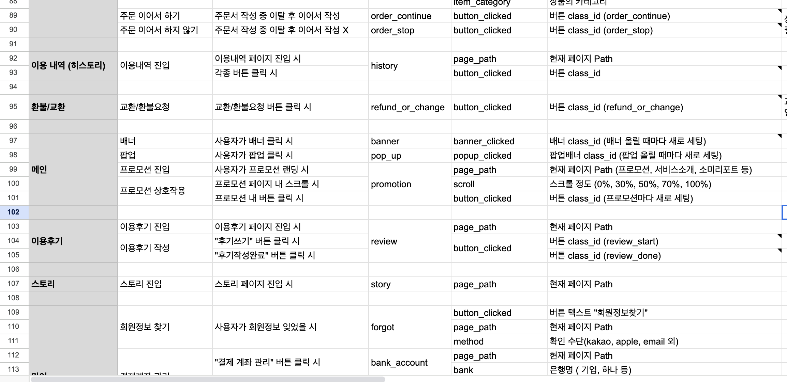
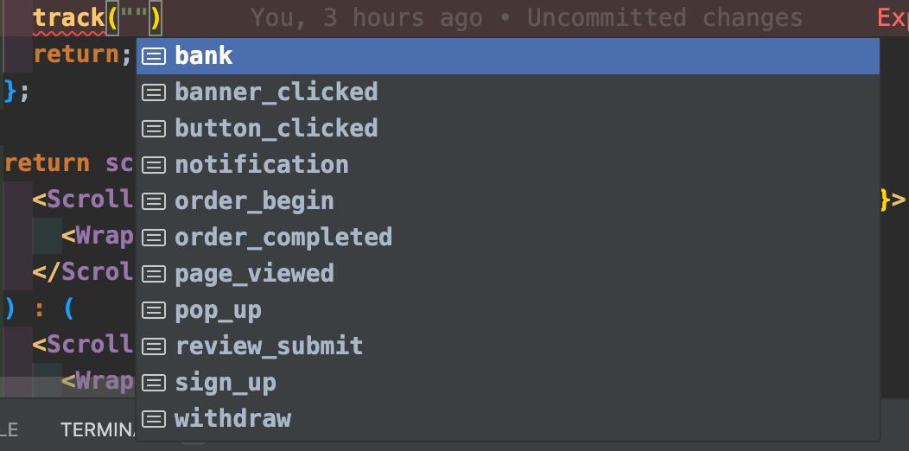
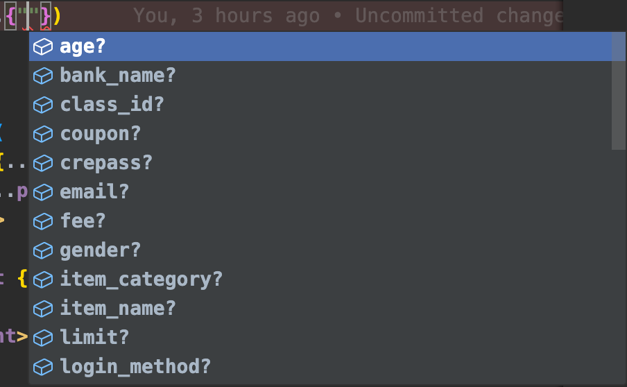
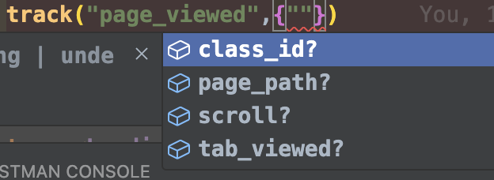

데이터 수집은 모든 온라인 비즈니스에서 중요한 부분 중 하나입니다. 사용자 행동 분석 이벤트 데이터를 수집하기 위해 저희는 믹스패널을 도입했습니다. 그러나 이 과정에서 이미 적용된 Google Analytics의 일화가 있었습니다. 그로스 팀과의 미팅에서 이벤트 추적이 잘 되지 않는 것 같다는 문제를 인식하게 되었습니다.

### 문제점 파악

문제를 파악하기 위해 코드와 이벤트 명세서를 살펴보았습니다. 그 결과, 무려 100개가 넘는 이벤트와 그에 해당하는 속성들이 있었는데요. 이 많은 양의 데이터 수집에서는 휴먼 에러가 없었으면 좋겠지만, 그런 보장이 없었습니다.



예를 들어, 객체로 만들어진 clickPayNow 이벤트 내의 다른 속성을 접근할 때 오타가 있는 속성에 접근하면 undefined를 반환하게 됩니다. 이 상태에서 이 undefined 값에 접근하려 하면 런타임 에러가 발생합니다.

이러한 문제를 해결하기 위해 JavaScript에서는 열심히 방어 코드를 작성해야 합니다. 이는 null 또는 undefined를 체크하거나 optional chaining으로 체크하는 방법 등이 있습니다. 이렇게 작성한 코드는 코드 품질을 향상시키고 런타임 에러를 방지할 수 있습니다. 그러나 자바스크립트 진영에서는 이러한 작업이 번거로울 수 있습니다.

그래서 저는 타입스크립트를 적극적으로 도입하여 생산성과 정확도를 높이는 방안을 모색했습니다.

### 타입 적용하기

먼저 `ssomeeMixpanel.track()`이란 함수는 이벤트 명세서에 정의된 이벤트 이름과 이벤트 이름에 해당되는 속성들을 인자로 받습니다. 이로써 mixpanel API로 전달 할 수 있습니다.

```typescript
export const ssomeeMixpanel = () => {
  return {
    track(eventType, properties) {
      // 함수 구현...
      try {
        mixpanel.track(eventType, properties);
        return;
      } catch (error) {
        console.warn(`fail to send to mixpanel eventName: ${eventType}`);
      }
    },
  };
};

ssomeeMixpanel.track("page_viewed", "");
```

`track()` 함수에 타입을 적용해보겠습니다. 저의 첫 시도는 이벤트이름에 유니온을 이용하자는 거였습니다.
유니온 타입은 합집합의 개념으로 이 타입 또는 저 타입을 허용하게 하는 타입입니다. `eventType`의 인자타입으로 `page_viewed` 또는 "sign_up" 또는 "login" 이 됩니다.

```typescript
type MixpanelEventName = "page_viewed" | "sign_up" | "login";

interface MixpanelProperties {
  page_path?: string;
  tab_viewed?: string;
  scroll?: number;
}
export const ssomeeMixpanel = () => {
  return {
    track(eventType: MixpanelEventName, properties: MixpanelProperties) {
      // 함수 구현...
      try {
        mixpanel.track(eventType, properties);
        return;
      } catch (error) {
        console.warn(`fail to send to mixpanel eventName: ${eventType}`);
      }
    },
  };
};
```

유니온 타입 설정 만으로도 아래의 이미지와 같이 이벤트 이름과 속성에서 자동 추론이 가능하게 되었고, Excel 파일로 이벤트 이름을 확인하는 수고를 덜 수 있었습니다.




하지만 엑셀파일을 왔다갔다 하면서 이벤트에 30개가 넘는 속성에 어떤걸 골라야 할지 매번 확인해야 했었습니다.

유니온 타입은 합집합과 같은 개념으로, 여러 타입 중 하나를 나타내며, 이를 통해 정의된 모든 타입을 포괄합니다. 첫번 째 인자에 따라 두번째 인자에서 자동 추론 되는 타입을 구체적으로 설정하는 것은 타입을 느슨하게 정의하는 것보다 이벤트 속성을 정확하고 신속하게 전달하는 데 더 유리했습니다. 비록 나중에 변경이 필요할 수도 있지만, 현재 저희가 직면한 문제를 해결하는 데는 이 방법이 더 적합하다고 생각했어요.
그래서 첫번 째 인자의 타입에 따라, 두번 째 인자의 타입을 엄격하게 적용하기로 했습니다.

제가 원하는건 특정 eventType을 선택하면, event에 해당하는 properties들이 자동으로 추론되기를 바랬어요.

properties 인자 자리에서는 어떤 eventType을 선택했는지 알 수 있을까요?
바로 제네릭을 이용합니다. 이렇게 제네릭을 사용하면, 특정 타입을 입력받아 그에 따라 반환되는 타입을 동적으로 생성할 수 있습니다.

먼저 제네릭 `T`를 사용하여 `track()` 의 첫 번째 매개변수는 이벤트 네임들 중 하나만 정할 수 있게 타입 제약을 둡니다.

```typescript
track<T extends MixpanelEventName>(eventType:T, properties:  ){
    },
```

그리고 첫번 째 매개변수에 사용하던 `T`가 , 두번째 매개변수에서 properties를 결정할 때 어떤 이벤트 네임을 사용했는지 알기 위해 `T`를 가져올 수 있습니다. 여기선 조건부 타입이 필요합니다. 조건부 타입은 특정 조건에 따라 타입을 다르게 할당 할 수 있게 해주는 강력한 도구입니다.

조건부 타입을 활용하여 개선을 해보죠!

일단 먼저 이벤트 정의서에 따르면 `page_viewed`를 선택했을 때 `class_id`, `page_path`, `tab_viewed`, `scroll`이란 속성들이 필요했습니다.

이 속성들은 'MixpanelProperties' 인터페이스로 지정되어 있는데요. 사실 MixpanelProperties 는 50개가 넘습니다. 그래서 여기서 필요한 속성을 선택해야 했었는데요 이럴 때 사용하는 유틸리티 타입인 `Pick`을 사용합니다.

```typescript
type PAGE_VIEWED_PROPERTIES = Pick<
  MixpanelProperties,
  "class_id" | "page_path" | "tab_viewed" | "scroll"
>;
```

이젠 `PAGE_VIEWED_PROPERTIES` 는 `page_viewed`라는 이벤트네임이 있을 때 사용 할 수 있도록 조건부 타입을 만듭니다.

```typescript
// 조건부 타입 예시
type EventProperties<T extends UnionMixpanelEventName> = T extends "page_viewed"
  ? PAGE_VIEWED_PROPERTIES
  : T extends "button_clicked"
    ? BUTTON_CLICKED_PROPERTIES
    : T extends "sign_up"
      ? SIGN_UP_PROPERTIES
      : // ... 나머지 이벤트 유형에 대한 처리
        never;
```

조건부 타입은 이렇게 자바스크립트에서 사용하던 삼항연산자를 통해 표현합니다.

`MixpanelPropertyMapper` 는 T 즉 이벤트 타입이 현재 어떤 이벤트 타입이 올지는 모르지만 함수가 호출될 때 이벤트 타입에 해당하는 속성들은 어떤 것을 보여줄지를 정하는 타입입니다.

**`T extends "page_viewed" ? PAGE_VIEWED_PROPERTIES : ...`**

이 부분은 만약 T 즉 이벤트타입이 `page_viewed`` 같다면, 결과 타입은 `PAGE_VIEWED_PROPERTIES` 됩니다.

함수를 사용하는 측에서의 결과를 한번 보죠 .



의도한대로 이벤트타입에 맞춘 properties들이 나왔습니다. 제가 원하던 타입 추론을 이뤘습니다.

코드를 다시 한번 볼게요.

```typescript
type MixpanelEventProperties<T extends UnionMixpanelEventName> =
  T extends MixpanelEventNames["PAGE_VIEWED"]
    ? PAGE_VIEWED_PROPERTIES
    : T extends MixpanelEventNames["BNANNER_CLICKED"]
      ? BANNER_CLICKED_PROPERTIES
      : T extends MixpanelEventNames["BUTTON_CLICKED"]
        ? BUTTON_CLICKED_PROPERTIES
        : T extends MixpanelEventNames["SIGN_UP_BEGIN"]
          ? SIGN_UP_BRGIN_PROPERTIES
          : T extends MixpanelEventNames["SIGN_UP"]
            ? SGIN_UP_PROPERTIES
            : T extends MixpanelEventNames["LOGIN"]
              ? LOGIN_PROPERTIES
              : T extends MixpanelEventNames["POP_UP"]
                ? POP_UP_PROPERTIES
                : T extends MixpanelEventNames["ORDER_BEGIN"]
                  ? ORDER_BEGIN_PROPERTIES
                  : T extends MixpanelEventNames["ORDER_COMPLETED"]
                    ? ORDER_COMPLETED_PROPERTIES
                    : T extends MixpanelEventNames["ORDER_CONTINUED"]
                      ? ORDER_CONTINUED_PROPERTIES
                      : T extends MixpanelEventNames["ORDER_STOP"]
                        ? ORDER_STOP_PROPERTIES
                        : T extends MixpanelEventNames["ORDER_CANCEL"]
                          ? ORDER_CANCEL_PROPERTIES
                          : T extends MixpanelEventNames["REFUND_EXCHANGE"]
                            ? REFUND_EXCHANGE_PROPERTIES
                            : T extends MixpanelEventNames["REVIEW_SUBMIT"]
                              ? REVIEW_SUBMIT_PROPERTIES
                              : T extends MixpanelEventNames["BANK"]
                                ? BANK_PROPERTIES
                                : T extends MixpanelEventNames["WITHDRAW"]
                                  ? WITHDRAW_PROPERTIES
                                  : T extends MixpanelEventNames["NOTIFICATION"]
                                    ? NOTIFICATION_PROPERTIES
                                    : T extends MixpanelEventNames["ADD_ACCOUNT"]
                                      ? ADD_ACCOUNT_PROPERTIES
                                      : never;
```

이 코드 앞으로 왠지 더 길어질 것 같지 않나요? 아마 1000줄도 가능하지 않을까요?
이 방식은 코드가 점점 더 길어지고 복잡해지는 경향이 있었습니다. 특히 삼항 연산자가 중첩되면서 가독성이 크게 떨어졌죠. 이러한 문제를 해결하기 위해, 좀 더 익숙하고 간결한 구조로 접근하기로 했습니다.

그래서 저희는 객체 리터럴을 활용한 구조로 전환했습니다.

```typescript
interface MixpanelEventProperties {
  page_viewed: PAGE_VIEWED_PROPERTIES;
  button_clicked: BUTTON_CLICKED_PROPERTIES;
  // ... 추가 이벤트 속성 매핑
}

type MixpanelPropertyMapper<T extends keyof MixpanelEventProperties> =
  MixpanelEventProperties[T];
```

이 구조를 통해 각 이벤트 이름에 대한 속성 타입이 MixpanelEventProperties 인터페이스 내에서 명확하게 매핑됩니다. 그리고 MixpanelPropertyMapper 타입은 이 매핑을 직접 활용하게 됩니다. 이로써 복잡한 삼항 연산자와 중첩 조건문을 벗어나 훨씬 명확하고 관리하기 쉬운 코드 구조를 갖추게 되었습니다.

```typescript
type MixpanelPropertyMapper<T extends keyof MixpanelEventProperties> =
  MixpanelEventProperties[T];
```

이 타입구조에 대해 조금 더 상세히 나열해 볼게요.

`MixpanelPropertyMapper는` 제네릭 타입 T를 받아, 해당하는 이벤트의 속성 타입을 추론합니다. 이는 코드의 유지보수를 용이하게 하며, 새로운 이벤트 타입이 추가될 때마다 쉽게 확장할 수 있는 구조를 제공합니다.

더불어 Mapped Type 은 기존의 객체 타입을 유지하면서도 각 속성의 타입을 변형하기가 상대적으로 쉽다고 생각했어요.

예를 들어
기존의 객체 타입을 유지하면서도 각 속성의 타입을 변형하기 쉬움.

예를 들어 `BUTTON_CLICKED_PROPERTIES` 가 이미 있지만 어떤 이유에 `button_clicked` 라는 이벤트가 들어왔다면, 기존의 `BUTTON_CLICKED_PROPERTIES`를 쓰는게 아닌 `SpecialButtonClickedProperties` 라는 독립적으로 정의해 둔 타입을 사용하게 하는거죠. 이럴 경우 다른 건 변경을 해도 이벤트 타입과 속성을 미리 매핑해둔 `MixpanelEventProperties` `interface`는 건드리지 않아도 된다는 점이 유지보수 면에서 좋다고 생각했어요.

```typescript
type SpecialButtonClickedProperties = {
  classId: string;
};

type SpecialEventPropertiesMap = {
  [T in keyof MixpanelEventProperties]: T extends "button_clicked"
    ? SpecialButtonClickedProperties
    : MixpanelEventProperties[T];
};
```

---

### 마치며

타입스크립트의 컨디셔널타입, 제네릭, never의 조합을 통해 얻은 성과와 변화를 정리해 보았어요.

- 제네릭과 extends의 조합으로 이벤트에 올수 있는 속성값을 제한했습니다. 이로 인해 사용하는 개발자는 마케팅팀에서 제시한 측정 요소 외의 다른 잘못된 요소를 전달할 수 없으므로 휴먼에러를 방지 할 수 있습니다.
- 타입추론이 훨씬 명확해지고 쉬워져 개발자의 생산성이 올라갑니다. 어떤 이벤트 이름을 선택해야 할 지 이벤트 명세서를 다시 보고 올 필요가 없습니다.
- single source of truth를 가질 수 있습니다. 다른 부서와의 협업에서 특히나 같은 리소스로 서로의 업무를 동기화할 수 있게 되어, 정보의 일관성과 정확성이 향상되었습니다. 이는 마케팅 팀에서 진행하는 사용자 행동 분석과 프론트엔드 어플리케이션의 이벤트 처리 간의 간극을 줄이는 데 중요한 역할을 했습니다.

글을 보시고 더 나은 개선 방안이나 생각하신 코멘트가 있다면, 아래 댓글란에 남겨주시면 감사하겠습니다. 성장하는 개발자에게 귀중한 양분이 될 것입니다.🙂
