이 글을 쓰게된 계기는 구글 웹폰트를 적용한 후 페이지 렌더링시 깜빡임 현상을 해결하는 과정에서 구글 웹폰트의 동작원리 그리고 웹폰트 성능 최적화에 대해 알게되면서 적용한 과정 이다.

- 잘못된 부분이나 더 괜찮은 방법 또는 의견을 나누고 싶다면 바로 알려주세요!

## 1.문제점과 측정

페이지 전환시 font가 깜빡이는 현상이 있었다. 문제점을 측정하기 위해 chrome performance, google light-house, 그리고 [webpagetest.org](https://webpagetest.org/) 이용하였다.
측정 환경은 slow 3g, disable cache, aws s3, cloudfront로 배포 후 버전을 대상으로 실행하였다.

측정하기

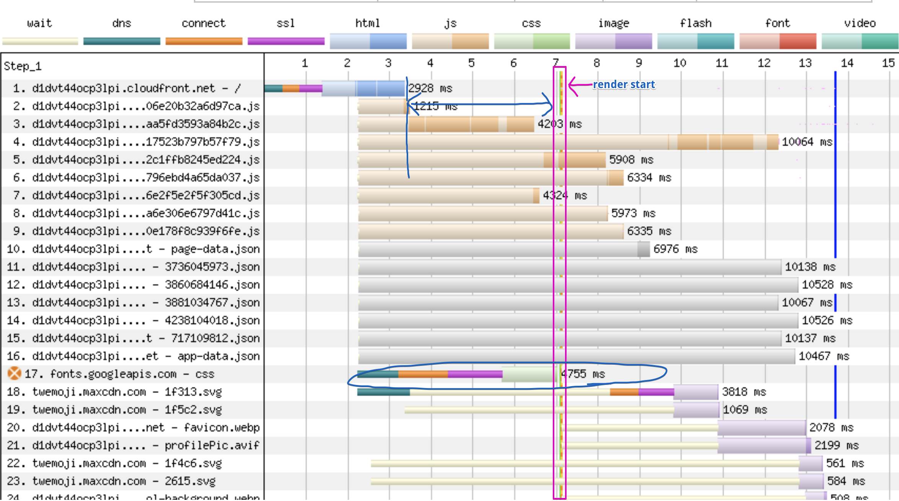

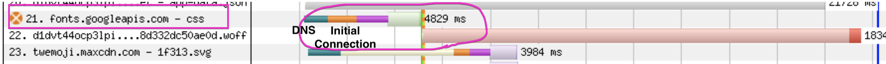
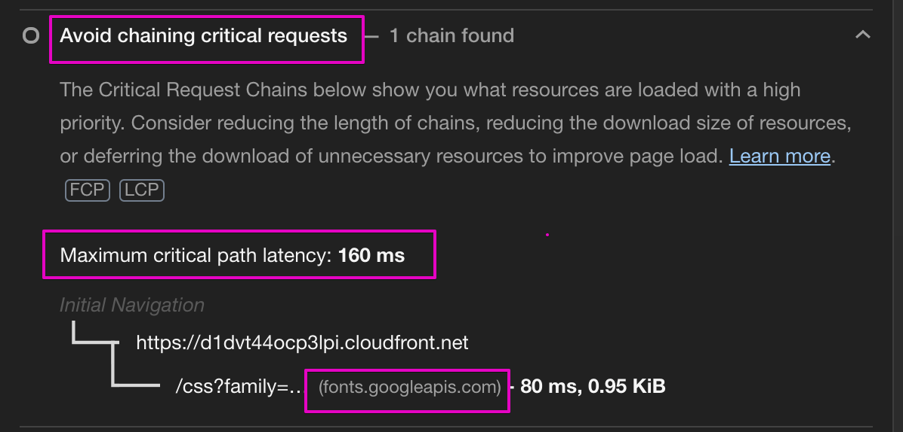

맨위의 두 사진은 각 리소스들의 waterfall 을 나타내는데, 첫 번째 이미지에서 17번 인 font.googleapis.com 요청이 구글 api로 부터 폰트를 다운로드 하는 과정 중의 하나인 css를 다운로드 하는 과정인데, 이 css파일이 다운로드가 끝나고서야 렌더링이 된다. 사실 그 전에 이미 작업을 마친 html과 js파일은 이 css 파일이 다운로드 되기 까지 기다려야 하는 렌더링 차단현상(3.5s 정도)을 겪고 있다.

두번째 이미지 또한 렌더링 차단으로 22번의 로컬 폰트 리소스가 4~5s 지연,저하되는 현상을 나타낸다.

문제점을 정리하자면,

1. 렌더링 차단
2. “Avoid chaining critical request” error - Lighthouse
3. 페이지 전환시 font가 깜빡 이는 현상

## 2. 렌더링 차단과 Google web fonts 동작원리의 관계

Google 웹폰트 사용시 사용되는 일반적인 태그이다.

```html
<link href="https://fonts.gstatic.com" rel="preconnect" crossorigin />
<link
  href="https://fonts.googleapis.com/css?family=Lato&display=swap"
  rel="stylesheet"
/>
```

href 속성을 통해 fonts.googleapi.com 으로 Lato 폰트를 요청한다.`rel=stylesheet` 와 같이 fonts.googleapi.com는 stylesheet 내에 @font-face로 Lato 폰트를 정의하여 stylesheet 파일로 보내준다.
그런 다음, 다시 @font-face에 정의된 local version 글꼴을 확인한다. 만약 없다면 fonts.gstatic.com에 연결하여 Lato 글꼴을 다운로드한다.

이런 방식은 좋은 퍼포먼스를 내기가 힘들다. 구글 폰트를 받기 위해서 DNS 요청 신호를 기다리는 것부터 css 파일을 받아 다시 파싱하기까지 렌더링을 차단하고 있다. 이 파싱이 끝나서야 비로소 원하는 글꼴이 렌더링이 된다.

“Avoid chaining critical request” 에러는 웹폰트 로드 시 렌더링 차단을 짚어준다. 브라우저는 페이지 로드 프로세스가 시작될 때 HTML을 파싱할 때 할당된 우선순위에 따라 중요한 요청을 한다. 지정하지 않는 한 HTML은 일반적으로 가장 높은 우선순위를 가지며 CSS, 이미지 및 JavaScript의 순서인데 이런 요청들이 긴 체인을 형성하게 되면 지연시간이 늘어나고 이는 페이지 로드 시간을 지연 시킨다.

Maximum critical path latency 는 중요한 요청의 리소스를 다운로드 되는데 걸리는 총 시간이다.

[공식 web.dev-Avoid chaining critical requests](https://web.dev/critical-request-chains/?utm_source=lighthouse&utm_medium=devtools)
에 따른 대응 방법을 나의 문제점과 결합하자면,

`<head>` 내부에 정의된 `<link>` 을 비동기로 처리하는 식인데 방법으로는 Resource Hint를 사용하는 것이고 그중에서 preload 와 preconnect 속성을 이용한다.

- preload

  preload가 적용된 지원은 가능한 가장 높은 우선순위로 간주되어 다운로드해야 한다고 브라우저에게 알려준다. 주의할 점이 있는데, 사용하는 자원이든 아니든, 리소스를 가져온다. 중복되어있는 리소스 포함. 그래서 현재 페이지에 필요한 리소스만 설정해야 한다.

- preconnect

  preconnect는 외부 도메인과의 연결을 미리 연결을 설정한다. 그래서 연결된 설정으로 리소스를 가져올 수 있으므로 DNS, TCP, TLS 왕복에 필요한 시간을 절약할 수 있다.

즉 브라우저가 리소스를 다운받는데 우선순위를 조정하거나 외부 도메인과의 연결에서 설정을 미리 하여 리소스를 받을 준비상태를 미리 만들어 놓아 효율적으로 다운로드 할 수 있도록 최적화하는 것이다.

### 2.1 Gatsby에서 구글 폰트 preloading 적용 그리고 결과

사용했던 gatsby-plugin-google-fonts 에서의 [Eliminate render-blocking resources #15
](https://github.com/didierfranc/gatsby-plugin-google-fonts/issues/15) 이슈는 아직 해결되지 않았으므로, [gatsby-plugin-webfonts](https://www.gatsbyjs.com/plugins/gatsby-plugin-webfonts/?=gatsby-plugin-web) 라는 플러그인을 사용하였다.

gatsby에서 빌드시 이 plugin은 @font-face css 파일을 생성 후 배포 시에는 폰트 파일를 가져오는 것이다.

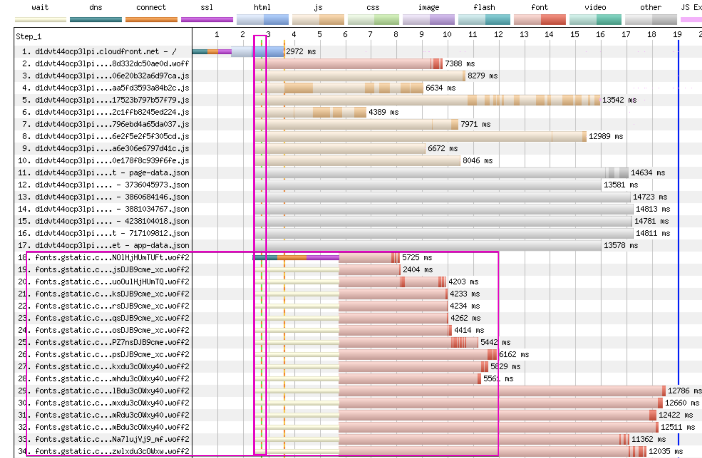

렌더링 차단이 없어진 덕에 초기 렌더링이 이전 7s -> 2.5s~3s 로 단축되었다.

브라우저별 호환성을 보자면,

### 2.2 브라우저 호환성

폰트 형식은 woff, woff2, EOT, TTF 종류가 있다.
woff2 가 가장 경량화되어있으며 30% 정도 파일 크기가 작으며 IE를 제외한 최신 브라우저들은 woff2를 지원한다, html 파일에서 preload 시 파일 형식으로도 적합하다.

구글 웹 폰트는 woff와 woff2를 지원한다. IE11 까지는 woff로 대응할 수 있지만 IE11 이전 버전을 지원하려면, EOT 또는 TTF 폰트 형식만이 가능한데 구글 웹폰트는 이 형식들을 지원하지 않는다.

##### woff2

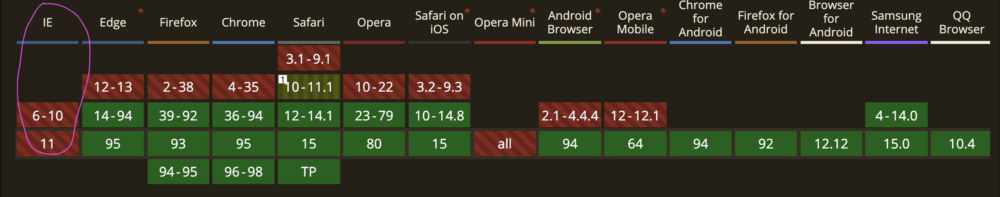

##### woff

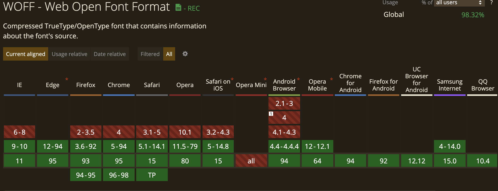

##### EOT

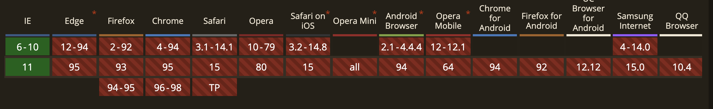

##### TTF


Resource Hints 인 `preload`와 `preconnect`는 IE에서 지원하지 않는다.
즉 preload가 지원되는 브라우저 라면 woff2도 같이 지원이 가능하며 IE 브라우저는 예외이다. IE를 대응하고자 한다면 셀프 호스팅을 고려해야 한다.

##### preload

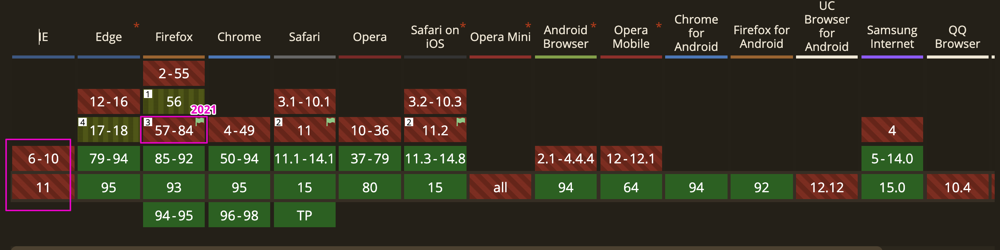

##### preconnect


## 3. 웹폰트 최적화엔 self hosting 폰트 사용?

IE 8 이하의 버전을 지원하고자 한다면 self hosting을 고려해야 한다는 언급 했었다. 이 외에도 더 이상 google font를 사용할 이유가 없다는 몇 가지 팩트들이 있었다.

### 3.1. 구글 폰트의 캐시 기간

일반적으로 "fonts.gstatic.com"에서 다운로드한 글꼴 파일만 캐시 기간이 1년이라고 알려져 있다. 재방문하는 사용자에겐 빠른 속도로 폰트를 제공할 수 있다고 하지만 사실 캐시 된 글꼴을 제공하려면 브라우저가 24시간마다 CSS 파일을 다운로드해야 한다. 그 이유는 기본 CSS 파일의 캐시 수명이 24시간 이기 때문이다. 또한 CSS파일을 다운로드하는 것은 렌더링을 차단하는 일에 다다른다.

### 3.2 개인 정보 보호를 위한 브라우저의 새로운 "캐시 파티셔닝"

크롬( Chrome: v86 이후(2020년 10월), 파이어폭스(2021년 1월 v85 이후), 사파리(2013년부터)는 새로운 [캐시 파티셔닝](https://developers.google.com/web/updates/2020/10/http-cache-partitioning)을 즉 "캐시 분할" 또는 "이중 키 캐싱"이라는 것을 구현했다.

##### 기존의 캐시 시스템

A 사용자: https://b.example 방문, https://x.example/doge.png 리소스 요청

A 사용자: https://c.example 방문, https://x.example/doge.png 리소스 요청

브라우저는 c.example 웹 페이지에서 캐시 된 리소스 버전을 사용한다. Cache key가 동일하기 때문에 브라우저는 캐시에서 리소스를 로드할 수 있다.
이런 캐시 시스템은 빠른 리소스를 로드하는 장점을 가져다 주지만 웹 사이트가 HTTP 요청에 응답하는 데 걸리는 시간은 브라우저가 과거에 동일한 리소스에 액세스 했음을 알 수 있기 때문에 (사용자의 검색 기록이 노출되는 위험성) 보안 및 개인 정보 공격에 노출 리스크가 있으므로, Chrome 86부터 HTTP 캐시를 분할하였다.

##### 캐시 파티셔닝

기존의 시스템에서 cache키는 하나 였으나, 새로운 시스템에서는 3개의 키로 구성되어진 튜플이다.

1. https://a.example (the top-level site) - 방문한 웹사이트
2. https://a.example (the current-frame site)
3. https://x.example/doge.png (the resource URL)

https://a.example에 방문하여 https://x.example/doge.png 이미지를 요청하는 경우 처음 방문이니 캐시에 저장한다.

- Cache Key: { https://a.example, https://a.example, https://x.example/doge.png }

같은 유저가 https://b.example 에 방문하고 같은 이미지를 요청한다. 기존 캐시 시스템과는 달리 the top-level site 캐시 키가 다르므로, 새로 캐시로 저장한다.

- Cache Key: { https://b.example, https://b.example, https://x.example/doge.png }

같은 유저가 이번엔 https://a.example를 방문하여 (https://x.example/doge.png)를 요청한다. 같은 top-level site 키와 the iframe 키가 있을 시 같은 리소스로 간주하고 캐시 된 리소스를 반환한다.

[더 자세한 내용 여기 참조 - developers.google/http-cache-partitioning](https://developers.google.com/web/updates/2020/10/http-cache-partitioning)

이런 방식 아래에서, Google 웹폰트는 예전처럼 항상 캐시 된 폰트를 제공할 수가 없다.

### 3.3 GDPR

예를 들어 fonts.com의 방문자가 페이지를 올바르게 표시하는 데 필요한 글꼴을 아직 캐시 하지 않은 경우, Google API로 글꼴을 요청하는 과정에서 Google은 사용자의 IP주소를 얻게 되는데 GDPR에 따른 고유한 개인 식별자에 해당된다.
그래서 유럽을 대상으로 한 사업체가 있다거나, 유럽에 거주하는 사람들이 이용하는 웹사이트라면 구글 폰트를 이용하기 위해선 Google Fonts에서 Google Fonts API로의 URL 호출이 발생하기 전에 사용자에게 동의를 요청하는 메시지를 표시해야 한다.

어느 정도 정리가 된다면 굳이 google font를 이용할 장점을 느끼지 못한다. 그리고 정말로 드물겠지만 CDN이 다운되는 일이 생기면 폰트 자체를 이용하지 못하는 일이 생긴다.

사실 제일 빠른 로딩이 가능하며, 이 모든 고민의 해결을 어느 정도 한 번에 풀 수 있는 방법은 system fonts를 사용하는 것이다. 하지만, 한정된 system fonts만을 사용하여 사용자들에게 즐거운 경험을 주기에는 개인적으로 안타까운 접근이라고 생각하기에 셀프 호스팅 폰트를 적용해 보았다.

## 4. 셀프호스팅 폰트 최적화 적용

셀프 호스팅의 최적화는 Google 웹 폰트에서 알아서 작업해줬던 일련의 과정들을 수동으로 설정해주는 것이다.

1. 최적화된 font format 로컬 파일
2. @font-face지정
3. preload 설정
4. FOUT, FOIT 대응

### 4.1. 최적화된 font format 로컬파일

셀프 호스팅의 경우 [google-webfonts-helper](https://google-webfonts-helperhttps://google-webfonts-helper)를 이용하면 구글 폰트에서 지원하는 폰트를 다운로드할 수 있게 지원하며 무엇보다도 구글 폰트에서 다운로드할 때 받을 수 없었던 woff, woff2까지 모두 지원한다. 즉, IE11 이하 버전까지도 지원할 수 있는 폰트 형식이다.
하지만 한글로 된 폰트들은 라틴문자에 비해 조합이 많으므로 파일이 10배까지도 크다.
이 파일들을 최적화하기 위해선 불필요한 글자를 제거하고 필요한 문자들만 담은 서브셋 폰트로 만드는 것이다.
경량화 방법은 여기를 참고하는 게 좋다. [한글 웹 폰트 경량화해 사용하기
](https://blog.coderifleman.com/2015/04/04/using-korean-web-fonts/)

> 서브셋 폰트는 일부 글리프나 영약만을 추출하여 새로운 폰트를 추출하는 것을 말한다.
> 일상생활에서는 잘 사용하지 않는 문자를 제외한 묶음이다.

[스포카](https://spoqa.github.io/spoqa-han-sans/)에서 EOF, TTF 파일을 제공하여 spoqa를 사용하기로 했다. 나머지 WOFF, WOFF2는 converter를 이용해 바꾸었다.

### 4.2. @font-face 지정

```css
@font-face {
  font-family: "Spoqa Han Sans Neo", "sans-serif";
  font-style: normal;
  font-weight: 600;
  font-display: swap; /*swap, */
  src:
    local("Spoqa Han Sans Neo") /* IE6-IE8 */ url(${Fonts.SpoqaSans600OTF}?#iefix)
      format("embedded-opentype"),
    /* Super Modern Browsers */ url(${Fonts.SpoqaSans600WOFF2}) format("woff2"),
    /* Modern Browsers */ url(${Fonts.SpoqaSans600WOFF}) format("woff"),
    /* IE6-IE11*/ url(${Fonts.SpoqaSans700TTF}) format("truetype");

  /* 영어 문자를 제외한 한글,숫자,특수 문자 적용*/
  unicode-range: U+AC00-D7A3, U+0030-0039, U+0020-002F, U+003A-0040,
    U+005B-0060, U+007B-007E;
}
```

##### local() 속성

로컬에 이미 설치 된 폰트의 경로를 적는 속성이다.
만약 google font api를 이용한다면, google api가 로컬에 지정된 폰트가 없으면 새로운 폰트를 호출하여 다운로드 한다.

##### url() 속성

다운로드 할 웹폰트의 주소를 적는 속성이다.

**`format()`을 사용하지 않을 경우**

예를 들어 크롬브라우저에선,

- local-> url(${Fonts.SpoqaSans600OTF}?#iefix) ->  url(${Fonts.SpoqaSans600WOFF2}) 순서로 불필요한 SpoqaSans600OTF 폰트를 다운로드 한다.
- format을 사용할 경우,
  local -> url(${Fonts.SpoqaSans600WOFF2}).

- 가장 용량이 작은 woff2형식을 기본으로 먼저 다운을 받고 만약 지원하지 않는 브라우저일 경우는 두번째인 woff형식을 다운 받는다.

##### UNICODE-RANGE

unicode-range를 이용해서 유니코드마다 다른 폰트를 지정할 수 있다.

- 한글 범위: U+AC00-D7A3
- 영어 대문자 범위 : U+0041-005A
- 영어 소문자 범위 : U+0061-007A
- 숫자 범위 : U+0030-0039
- 특수 문자: U+0020-002F, U+003A-0040, U+005B-0060, U+007B-007E

### 4.3. preload 설정

나는 react-helemt을 이용하였다. gatsby 에선 검색 엔진 최적화를 할 수 있도록 도와주는 라이브러리인 react-helmet의 확장한 플러그인을 사용할 수 있다.

```shell

npm i react-helmet gatsby-plugin-react-helmet

```

```javascript
//gatsby-config.js

module.exports = {
  .
  .
  plugins: [
    `gatsby-plugin-react-helmet`,
  ]
  .
  .
}


```

```jsx
//SEO.jsx

import { Helmet } from "react-helmet";

const SEO = () => (
  <>
    <Helmet>
      <link
        rel="preload"
        as="font"
        href={SpoqaSans700WOFF2} //font path
        type="font/woff2"
        crossOrigin="anonymous"
      />
    </Helmet>
  </>
);
```

['gatsby -How to preload self-hosted fonts? #13074'](https://github.com/gatsbyjs/gatsby/issues/13074) 참고

### 4.4. FOUT(Flash of Unstyled Text), FIOT(Flash of Invisible Text)

preload로 인해서 렌더링이 된 후에도 폰트를 다운로드되는 과정이 이어지기 때문에 그때까지는 아무것도 보이지 않는 FIOT 현상이 일어날 수 있다.
처음 Lighthouse에서 받은 에러로 `“ensure text remains visible during web font load”`가 FIOT 현상을 이야기한다.

브라우저마다 웹페이지에 큰 폰트 파일을 로드하는 과정에서 생기는 지연을 처리하는 방식이 조금 다른데, FOIT, FOUT가 있다.

1. FOIT는 글꼴을 로드할 준비가 되지 않은 경우 일부 브라우저는 텍스트를 완전히 숨긴다. Chrome이나 Firefox는
   3초 동안 텍스트를 숨기고 그때까지 폰트가 로드되지 않으면 시스템 폰트가 로드된다. Safari의 경우는
   모든 글꼴을 로드할 때까지 텍스트를 완전히 숨긴다.

2. FOUT는 Internet Explorer에서 처리하는 방식인데 웹 폰트가 로딩될 때까지 시스템폰트/fallback 폰트를 먼저 보여준다. 웹 폰트 로딩이 완료되면 텍스트를 웹 폰트로 전환한다.
   사용자는 blank 페이지를 보지 않고 항상 텍스트를 볼 수 있는 장점이 있다. 하지만 웹폰트와 시스템폰트/fallback 폰트 사이의 글꼴의 자간, 높이 등 서식의 차이에 따라 폰트의 전화시점에 레이아웃이 변경될 수 있다(layout shift performance). 이는 [fontStyleMatcher](https://meowni.ca/font-style-matcher/)를 통해서 글꼴간의 서식을 통일감있게 맞출 수 있다.

FIOT를 해결 할 방법으로 `@font-face` 에서 `font-display: swap` 속성을 이용하여 FOUT로 전환하는데, 이는 사용자 입장에서는 아무것도 보지 않는 것보다 빠르게 시스템 폰트를 먼저 보고 폰트 다운로드가 완료된 후에 다운로드된 폰트를 보게 되는 것이다.

[font-dsplay의 속성 값과 차이점에 대한 자세한 설명 - naverD2-웹 폰트 사용과 최적화의 최근 동향](https://d2.naver.com/helloworld/4969726)

```css
@font-face {
	.
	.
    font-display: swap;
	.
	.
}

```

##### font-display를 지정하기 전

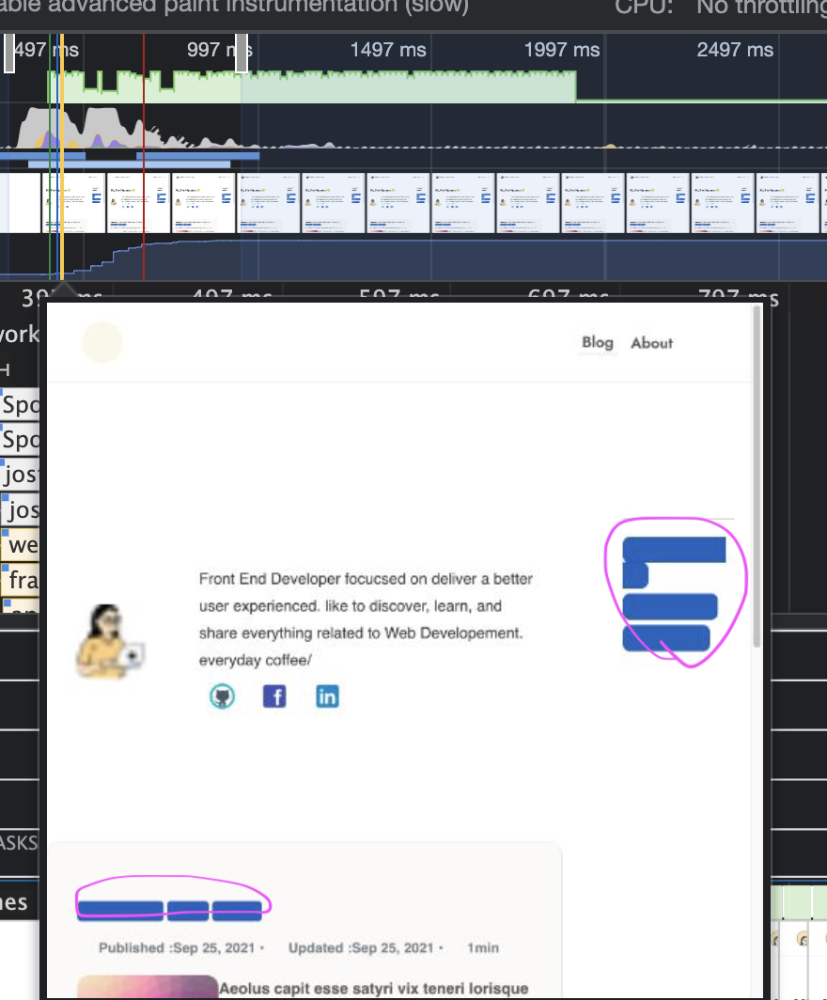

##### font-display:swap 지정 후

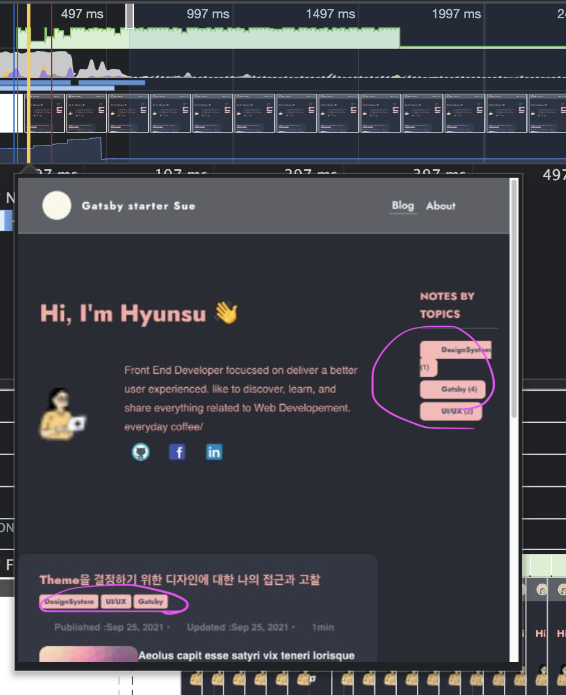

### 4.5 최적화 전,후 light house

- 5번 시도에서의 평균

##### 최적화 전

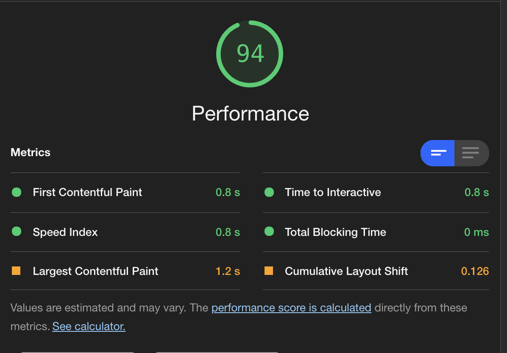

##### 최적화 후

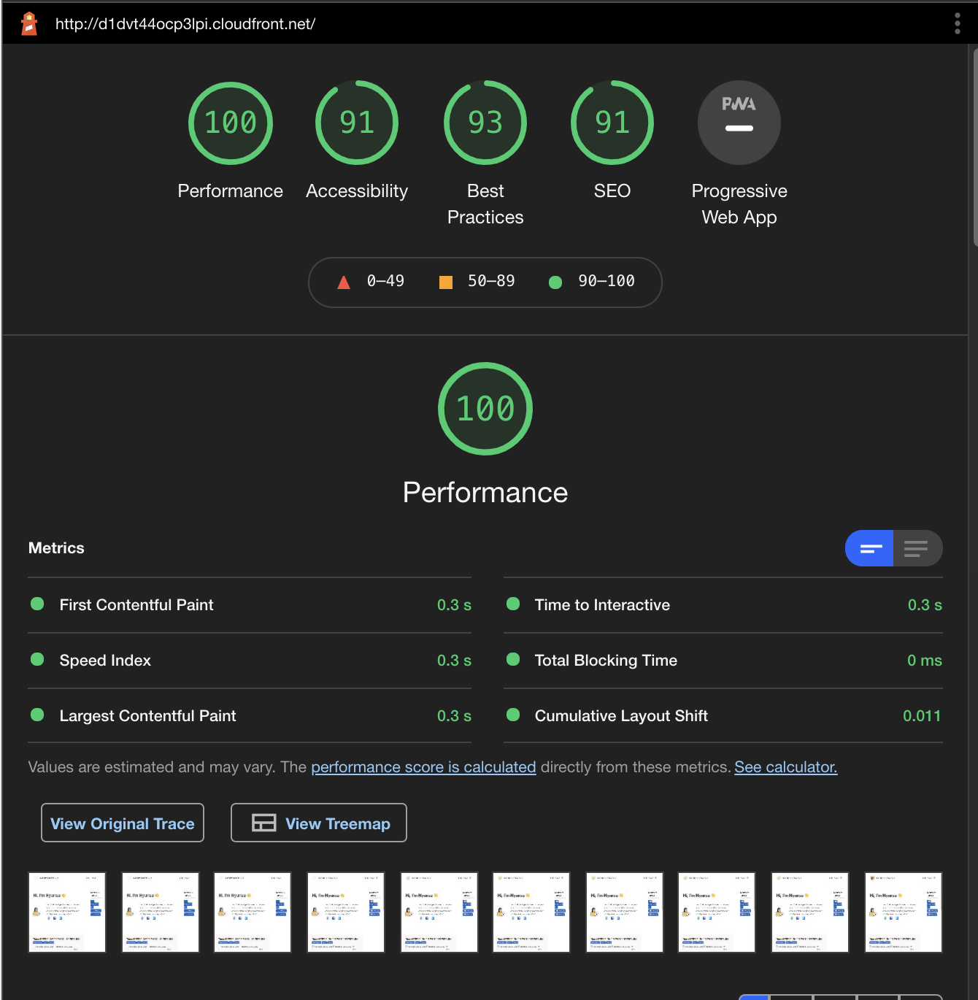

## 5. 셀프호스팅 폰트 vs 구글 웹폰트

### 5.1. 셀프 호스팅 폰트

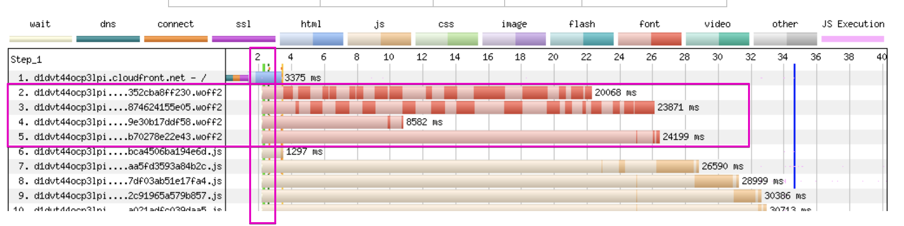

### 5.2. 구글 웹 폰트


셀프 호스팅 한글 폰트가 확실히 구글 한글 폰트에 비해 많으면 20배 넘게도 20KB -> 466KB 차이난다. LCP(Largest Contentful Paint)에서는 둘 비슷한 수치를 나타낸다. 그렇다고 이 측정만으로 두 방식이 비슷하다라고만 볼 수는 없다. 현재 사용 중인 폰트 수가 많지 않으며, preloading이 되는 리소스들이 많아지거나, 웹의 복잡성, 규모에 따라 결과는 충분히 달라지기 때문이다. 하지만 알 수 있는 것은 현재 블로그 내에서 다양한 폰트를 사용하지 않을 경우, 많은 리소스들이 있지 않은 경우에는 셀프 호스팅과 구글 웹폰트를 최적화할 경우 비슷한 퍼포먼스를 도출한다고 볼 수 있다.

## 마무리

웹폰트 주제가 알면 알 수록 재미있고 생각보다 깊은 주제였다. 모르는 더 많은 것들이 있지만 나의 gatsby 블로그에서의 웹폰트 최적화는 전반적인 성능 향상에 크게 기여가 되었다.
만약 Google 웹폰트를 사용한다면 폰트의 경량화 작업을 생각할 필요도 없고 어떤 버전을 결정하는 데 도움이 되도록 브라우저 지원을 확인하는 번거로움도 없을 것이다. 하지만, 캐시 성능 면에서 보았을 때도 그랬지만 더이상 Google 웹 폰트가 캐시로 더 빠르게 제공한다는 이점도 없는 것이다. 또한 더이상 구글로부터 내 클라이언트들의 정보를 자유롭게 하고 싶다면 셀프 호스팅이 낫지 않을까 싶다.

---

##### 참고자료

- [김원준 님의 웹폰트 사용하기](https://wit.nts-corp.com/2017/02/13/4258)
- [naver d2 -웹 폰트 사용과 최적화의 최근 동향](https://d2.naver.com/helloworld/4969726)
- [simonhearne - How to avoid layout shifts caused by web fonts](https://simonhearne.com/2021/layout-shifts-webfonts/)
- [web.dev - optimize webfont loading](https://web.dev/optimize-webfont-loading/)
- [Gijo Varghese - Why you should Self-Host Google Fonts in 2021](https://wpspeedmatters.com/self-host-google-fonts/)
