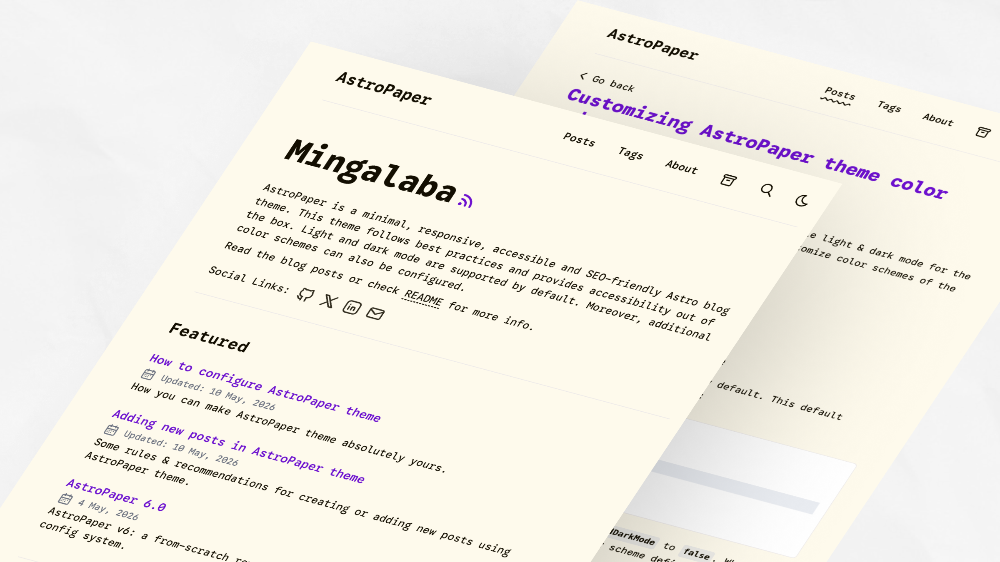
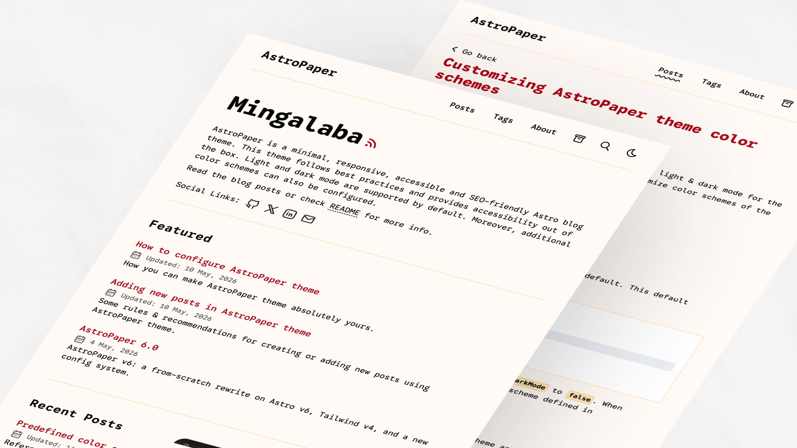

import ResponsiveTable from '@/components/ResponsiveTable.astro';

AstroPaper includes a collection of predefined color schemes that can be applied to customize the theme appearance. Each scheme defines a complete set of CSS custom properties (variables) for light and dark modes.

## Table of contents

## Quick Start

To apply a predefined color scheme, copy the CSS variable definitions into your theme configuration. For detailed setup instructions, see the [color scheme configuration guide](https://astro-paper.pages.dev/posts/customizing-astropaper-theme-color-schemes/).

## CSS Variables Reference

All color schemes use the following CSS custom properties:

<ResponsiveTable variant="striped-minimal">

| Variable              | Purpose                                                  |
| --------------------- | -------------------------------------------------------- |
| `--background`        | Primary background color                                 |
| `--foreground`        | Primary text color                                       |
| `--accent`            | Accent/interactive elements (links, buttons, highlights) |
| `--accent-foreground` | Text color on accent backgrounds                         |
| `--muted`             | Secondary background color for subtle sections           |
| `--muted-foreground`  | Text color for secondary content                         |
| `--border`            | Border and divider color                                 |

</ResponsiveTable>

## Light Schemes

Light color schemes are defined using the CSS selectors `:root` and `[data-theme="light"]`.

### Paper Light

Default AstroPaper light theme.


```css
:root,
[data-theme="light"] {
  --background: #fdfdfd;
  --foreground: #282728;
  --accent: #006cac;
  --accent-foreground: #ffffff;
  --muted: #e6e6e6;
  --muted-foreground: #6b7280;
  --border: #ece9e9;
}
```

### Kha-Yan

Purple-focused light scheme with warm background.



```css
:root,
[data-theme="light"] {
  --background: #fefaec;
  --foreground: #120e01;
  --accent: #6e10cf;
  --accent-foreground: #fefaec;
  --muted: #dcdcdc;
  --muted-foreground: #6b7280;
  --border: #cdc4d6;
}
```

### Nila

Light purple scheme with cool blue undertones.


```css
:root,
[data-theme="light"] {
  --background: #f6f6fb;
  --foreground: #0c0c19;
  --accent: #6760b4;
  --accent-foreground: #f3f3f3;
  --muted: #dddcea;
  --muted-foreground: #54515b;
  --border: #d8d6ec;
}
```

### Jadeite

Teal-accented light scheme with neutral background.


```css
:root,
[data-theme="light"] {
  --background: #f6fcf7;
  --foreground: #060b07;
  --accent: #027c6d;
  --accent-foreground: #ffffff;
  --muted: #c9e4e2;
  --muted-foreground: #6b7280;
  --border: #d4e1df;
}
```

### Pyit Tine Htaung

Red and gold accent scheme with warm tones.



```css
:root,
[data-theme="light"] {
  --background: #fffaf6;
  --foreground: #060503;
  --accent: #aa0215;
  --accent-foreground: #ffcf75;
  --muted: #ffdc98;
  --muted-foreground: #54515b;
  --border: #ffdc98;
}
```

## Dark Schemes

Dark color schemes are defined using the CSS selector `[data-theme="dark"]`.

### Paper Dark

Original AstroPaper dark theme with cyan accents.


```css
[data-theme="dark"] {
  --background: #2f3741;
  --foreground: #e6e6e6;
  --accent: #1ad9d9;
  --accent-foreground: #0d2b2b;
  --muted: #596b81;
  --muted-foreground: #8faabb;
  --border: #3b4655;
}
```

### Paper Dark II

Current default dark theme with orange accents.


```css
[data-theme="dark"] {
  --background: #212737;
  --foreground: #eaedf3;
  --accent: #ff6b01;
  --accent-foreground: #ffffff;
  --muted: #343f60;
  --muted-foreground: #afb9ca;
  --border: #ab4b08;
}
```

### Deep Purple

Vibrant magenta accents dark scheme.


```css
[data-theme="dark"] {
  --background: #212737;
  --foreground: #eaedf3;
  --accent: #eb3fd3;
  --accent-foreground: #1a0d1a;
  --muted: #513f51;
  --muted-foreground: #c09abc;
  --border: #642451;
}
```

### Ember

Warm, muted dark scheme with red accents.


```css
[data-theme="dark"] {
  --background: #1a1a1a;
  --foreground: #f5efe4;
  --accent: #ff3737;
  --accent-foreground: #1a1a1a;
  --muted: #38342f;
  --muted-foreground: #a59a8c;
  --border: #6f5648;
}
```

### Espresso

Brown-focused warm dark scheme.


```css
[data-theme="dark"] {
  --background: #2f2f2f;
  --foreground: #ebe5e1;
  --accent: #ee781e;
  --accent-foreground: #1a1a1a;
  --muted: #4f4b44;
  --muted-foreground: #ddbfa7;
  --border: #6f5648;
}
```
