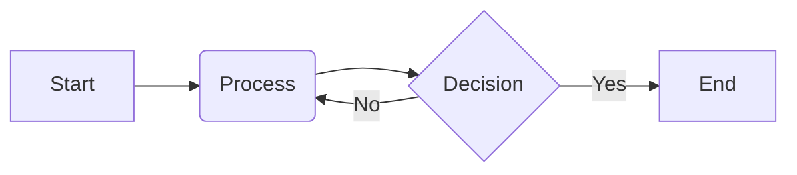

## Basic Usage Example

One of the best things about Mermaid is how you can create complex diagrams with just a few lines of simple text. Here’s a basic flowchart written in a Markdown file:



It's important to specify the language as `mermaid` right after the three backticks (\`\`\`). If you forget to add the language identifier, the browser won't know to render the diagram. Instead, it will just display it as a plain code block, like this:

```
graph LR;
    A[Start] --> B(Process);
    B --> C{Decision};
    C -->|Yes| D[End];
    C -->|No| B;
```

By simply adding the `mermaid` language tag, you can enable diagrams\!
