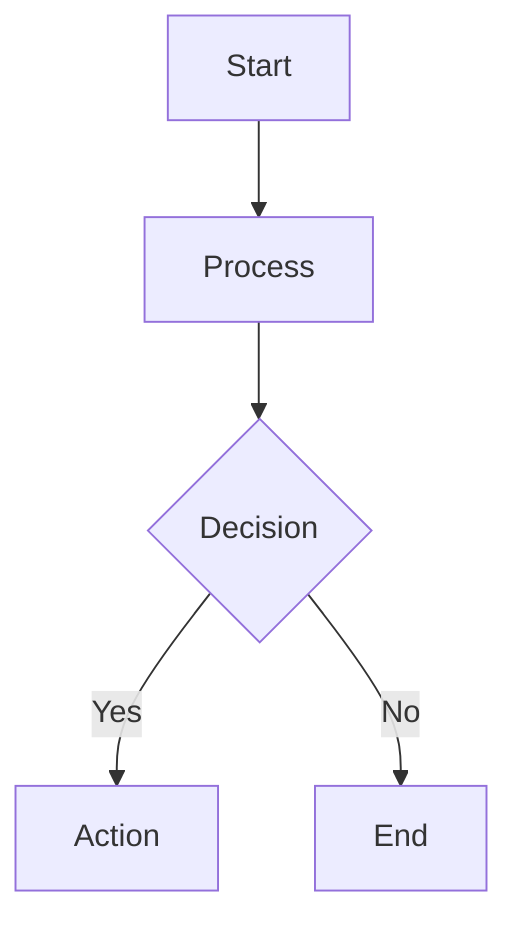
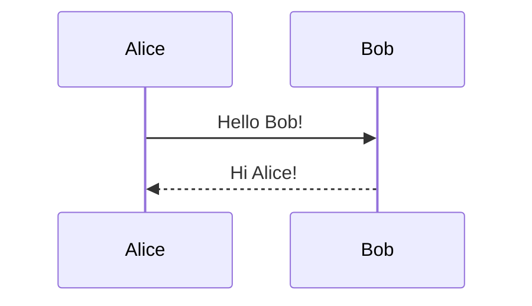

This post demonstrates the difference between rendering Mermaid diagrams and showing the raw code.

## Raw Code (will NOT render)

Use `text` as the language identifier to show the code:

```text
graph TD
    A[Start] --> B[Process]
    B --> C{Decision}
    C -->|Yes| D[Action]
    C -->|No| E[End]
```

## Rendered Diagram (WILL render)

Use `mermaid` as the language identifier to render the diagram:




## Another Example: Sequence Diagram

Raw code:

```text
sequenceDiagram
    Alice->>Bob: Hello Bob!
    Bob-->>Alice: Hi Alice!
```

Rendered:



## Summary

| Language Identifier | Result             |
| ------------------- | ------------------ |
| `mermaid`           | Renders as diagram |
| `text`              | Shows raw code     |
| `plaintext`         | Shows raw code     |
| (none)              | Shows raw code     |
